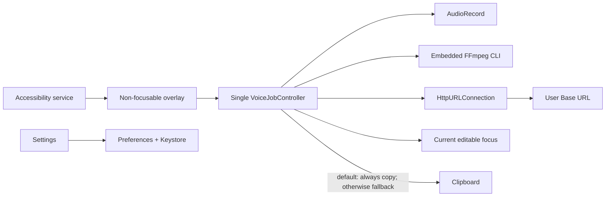
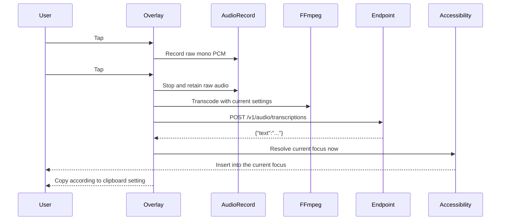
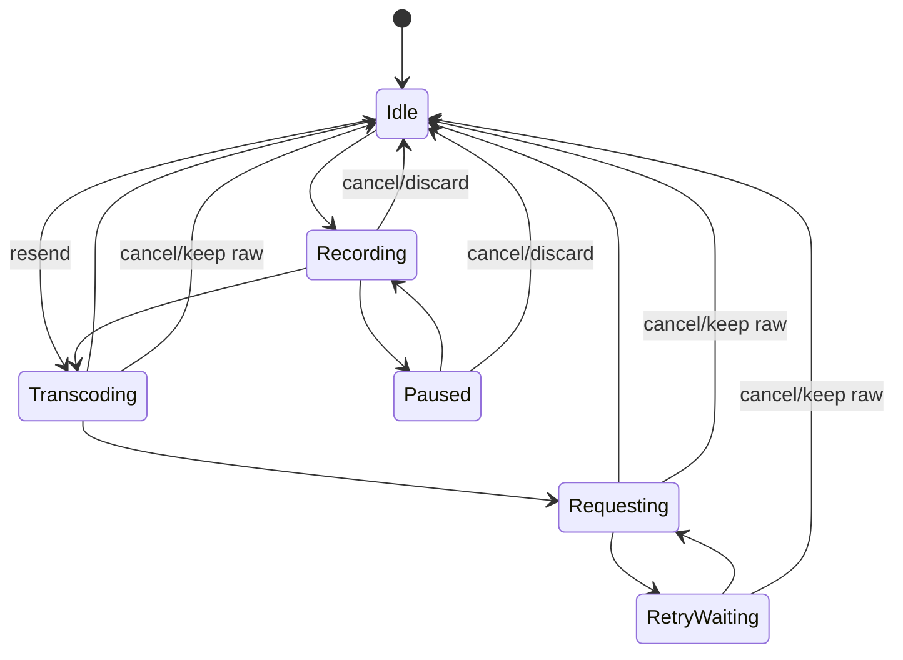

English | [简体中文](README_ZH.md)

# Dictate

Dictate is an Android voice-transcription enhancement layer, not an input method editor. It shows one non-focusable accessibility overlay, records one voice task, sends it directly to the user's OpenAI-compatible endpoint, and inserts the returned top-level `text` into the editable focus that exists when the response arrives.

## Features

- No IME, keyboard, candidate bar, editing context, history list, cloud account, or proxy server.
- `AudioRecord` PCM capture with pause/resume, microphone foreground service, wake lock, and cancellation.
- Draggable, non-focusable accessibility overlay with persisted, inset-aware screen position; dragging never changes the active voice task.
- An in-progress recording continues while the screen is off; no lock-screen controls or lock-screen text insertion are provided.
- Embedded FFmpeg `n8.1`, Opus `1.5.2`, and LAME `3.100`, built from source for `arm64-v8a` only.
- Opus, MP3, AAC, and PCM/WAV output with valid codec/container choices only.
- Direct multipart requests to OpenAI-compatible `/v1/audio/transcriptions`; success requires a non-empty top-level JSON string `text`.
- Current-focus insertion plus a configurable clipboard safety copy, enabled by default; when disabled, clipboard remains the insertion-failure fallback.
- Cancellable FFmpeg process, HTTP request, and exponential retry wait, all protected by a monotonically increasing task ID.
- Keystore-backed API Key encryption, redacted diagnostics, real endpoint test, and validated JSON import/export.

| State | Tap | Hold | Fast double tap |
|---|---|---|---|
| Idle | Record | Resend previous recording | No action |
| Recording | Stop and transcribe | Pause | Cancel and discard |
| Paused | No action | Resume | Cancel and discard |
| Processing | No action | No action | Cancel and keep raw recording |

Gesture precedence is `drag > hold > double tap > tap`. A hold is confirmed on release, so movement beyond the system touch threshold at any point before release always becomes a drag. A short tap is confirmed only after the configured double-tap window, so a fast double tap always has one unambiguous outcome.

## Downloads

| Platform | Download | SHA-256 |
|---|---|---|
| arm64-v8a | [arm64-v8a](https://github.com/Joey-Kot/Dictate/releases/download/Latest/Dictate-latest-arm64-v8a.apk) | [sha256](https://github.com/Joey-Kot/Dictate/releases/download/Latest/Dictate-latest-arm64-v8a.apk.sha256) |

## Architecture



## Request Sequence



The recording-start field, app, cursor, and selection are never stored. Focus is resolved only after a valid response.

## Job state machine



Internal states are exactly idle, recording, paused, transcoding, requesting, and retry waiting.

## Requirements

- Android 8.0+ (`minSdk 26`) on an `arm64-v8a` device.
- Microphone permission and enabled Dictate accessibility service.
- An OpenAI-compatible `POST /v1/audio/transcriptions` endpoint, Base URL, API Key, and model.

Accessibility insertion is best effort. Password fields, financial apps, games, protected screens, and custom-drawn editors may reject it. Dictate does not contain per-app compatibility logic.

## Build from source

Use JDK 17, Android SDK Platform 35, Build Tools 35.0.0, and NDK `27.2.12479018`.

```bash
export ANDROID_HOME=/path/to/android-sdk
export ANDROID_NDK_HOME="$ANDROID_HOME/ndk/27.2.12479018"
./scripts/build-android-ffmpeg.sh
./gradlew :app:assembleDebug
```

The FFmpeg script writes `app/src/main/jniLibs/arm64-v8a/libffmpeg.so`. Signed releases additionally use `ANDROID_KEYSTORE_PATH`, `ANDROID_KEYSTORE_PASSWORD`, `ANDROID_KEY_ALIAS`, and `ANDROID_KEY_PASSWORD`.

The script verifies the official FFmpeg `8.1`, Opus `1.5.2`, and LAME `3.100` source archives by SHA-256, builds only AArch64, checks every required demuxer/encoder/muxer/filter, and emits a 16 KiB-page-compatible Android PIE executable named `libffmpeg.so`.

The packaged connectivity-test clip is a synthetic 16 kHz mono rendering of the word “test”, generated from Flite `2.2`'s `cmu_us_slt` voice. Its reproducible generation command is in `scripts/generate-connectivity-test-audio.sh`; provenance and the CMU notice are recorded in `THIRD_PARTY_LICENSES.md`.

GitHub release signing uses these repository secrets:

```text
ANDROID_KEYSTORE_BASE64
ANDROID_KEYSTORE_PASSWORD
ANDROID_KEY_ALIAS
ANDROID_KEY_PASSWORD
```

GitHub Actions is the default release path. Pushes to `main` and `dev`, plus manual dispatches with an optional ref, build a signed arm64 APK, generate the standard SHA-256 file, force-update the `Latest` tag, delete old Release assets, and upload only the current pair. One shared concurrency group prevents an older overlapping build from replacing a newer `Latest` publication.

## How to use (Configure)

1. Grant microphone and notification permissions and enable Dictate in Android accessibility settings.
2. Enter Base URL (`https://example.com` or `https://example.com/v1`), API Key, and model.
3. Optionally add a flat JSON object of multipart fields. Arrays, nested objects, `null`, `file`, and `model` are rejected.
4. Run the real endpoint test, which transcodes an embedded short spoken clip with current audio settings and calls the transcription endpoint—not `/v1/models`.
5. Save, keep a cursor in an ordinary editable field, and use the floating button.

The clipboard safety copy is enabled by default. Turning it off restores fallback-only behavior: Dictate copies only when current-focus insertion fails.

Use HTTPS. Audio goes directly to the configured Base URL. Dictate provides no API, proxy, account system, or storage of user API traffic. API Keys are encrypted with an AES key held by Android Keystore and omitted from exports by default; importing one requires explicit confirmation.

## License

`GPL-3.0-or-later`. See [LICENSE](LICENSE), [NOTICE](NOTICE), and [THIRD_PARTY_LICENSES.md](THIRD_PARTY_LICENSES.md).
