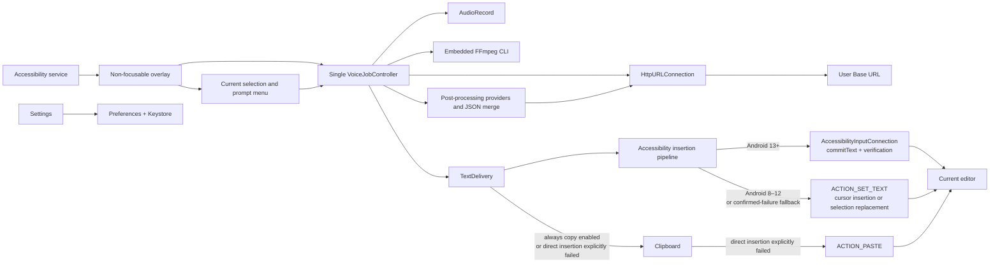
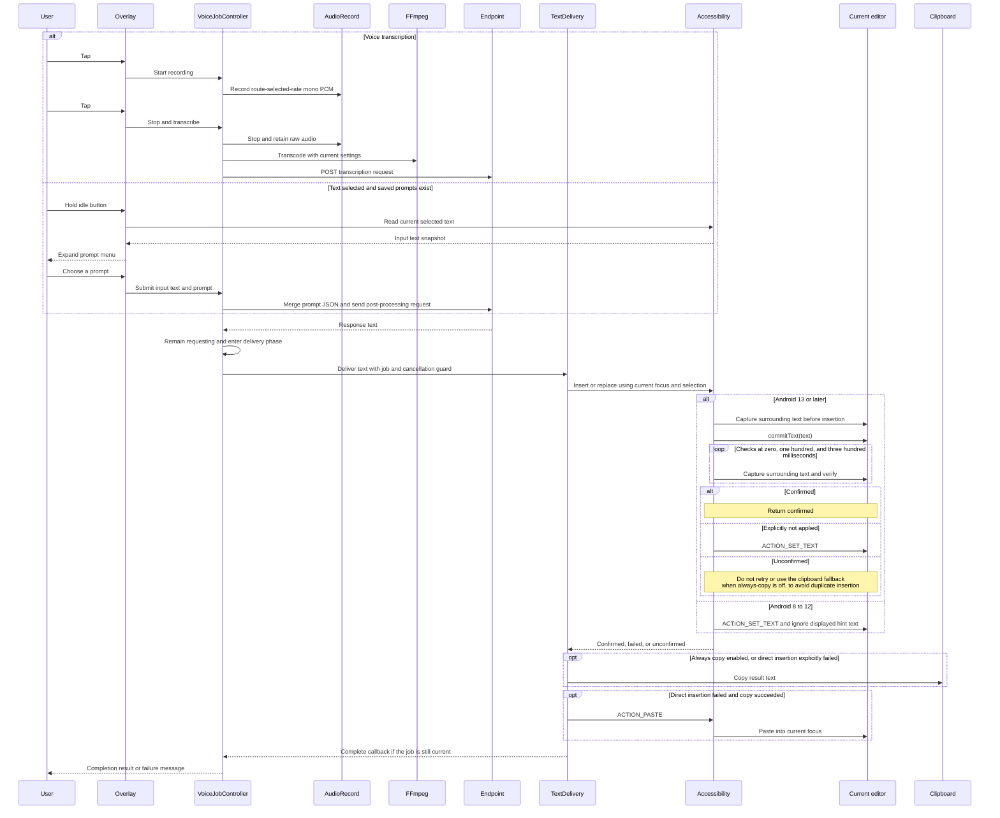
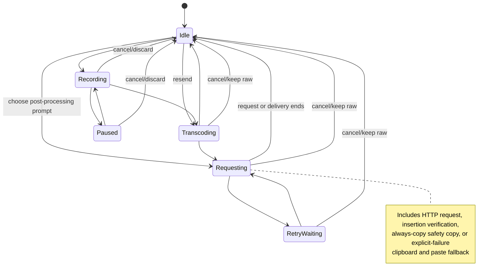

English | [简体中文](README_ZH.md)

# Dictate

Dictate is an Android speech transcription and selected-text post-processing tool operated through an accessibility floating button that does not steal focus. Audio or selected text is sent directly to the service specified by the user, with one task executed at a time. Transcription and post-processing share the same write rule: if there is no selection when writing, the text is inserted at the current cursor position; if there is an editable selection, that portion of text is replaced.

## Demo and Configuration

| [](demo/Demo-EN.gif) |
| :---: |
| **Dictate in action**<br>Use the floating button to transcribe speech, then select text and apply your own prompts to rewrite or translate it. |

| [](demo/1.%20Permissions.png) | [](demo/2.%20UI%20language.png) |
| :---: | :---: |
| **1. Permissions**<br>Enable the accessibility service and grant microphone permission. | **2. UI language**<br>Choose English, Chinese, Japanese, German, French, or Russian, then save to apply. |
| [](demo/3.%20Audio%20Record%20Settings.png) | [](demo/4.%20Audio%20API%20Settings.png) |
| **3. Audio Record Settings**<br>Choose the output sample rate, codec, container, and bitrate. | **4. Audio API Settings**<br>Set the transcription Base URL, API Key, model, and additional JSON parameters; test with a real transcription request. |
| [](demo/5.%20Rewrite%20API%20Settings.png) | [](demo/6.%20Prompt%20Edit.png) |
| **5. Rewrite API Settings**<br>Configure the text-processing provider, Base URL, API Key, and model; manage prompt order and test the connection. | **6. Prompt editor**<br>Set each prompt's icon, title, instructions, and additional JSON parameters, including model overrides. |
| [](demo/7.%20Retry%20Settings.png) | [](demo/8.%20Interaction%20Settings.png) |
| **7. Retry Settings**<br>Enable automatic retries and set the maximum retry count and initial delay. | **8. Interaction Settings**<br>Configure clipboard copying, the long-press threshold, and the maximum double-tap interval. |
| [](demo/9.%20Display%20Settings.png) | [](demo/10.%20Configuration%20Saving%20and%20Import%26Export.png) |
| **9. Display Settings**<br>Adjust the floating button's size, opacity, and state colors, and manage notification settings. | **10. Save, import, and export**<br>Save settings, import or export JSON configuration, and view or clear diagnostics. |

## Introduction to the Audio Transcription Feature

- Non-IME format, with no keyboard, candidate bar, history list, cloud account, or proxy service.
- `AudioRecord` PCM capture at the active input route's selected sample rate, in 16-bit mono, with pause/resume, microphone foreground service, wake lock, and cancellation.
- Draggable, non-focusable accessibility overlay with persisted, inset-aware screen position; its size, opacity, and recording/paused/processing color scheme are configurable and update without restarting the accessibility service.
- An in-progress recording continues while the screen is off; no lock-screen controls or lock-screen text insertion are provided.
- Build FFmpeg `n8.1`, Opus `1.5.2`, and LAME `3.100` from source; currently, only `arm64-v8a` prebuilt binaries are provided.
- Opus, MP3, AAC, and PCM/WAV output with valid codec/container choices only; output rate follows the active capture rate by default (capped at 48 kHz).
- Send multipart requests directly to the OpenAI-Compatible `/v1/audio/transcriptions`; successful responses must contain a non-empty top-level `text` string. Support for APIs other than OpenAI-Compatible is not currently considered. If you need services from other providers, you may use any compatible conversion service to convert them for use as OpenAI-Compatible.
- The clipboard safety copy is enabled by default; when disabled, clipboard is used only after an explicit insertion failure.
- Cancellable FFmpeg process, HTTP request, and exponential retry wait, all protected by a monotonically increasing task ID.
- Keystore-backed API Key encryption, redacted diagnostics, real endpoint test, and validated JSON import/export.

### Introduction to the selected-text processing feature

- Select text, hold the idle floating button, and choose a prompt from the menu to process the selection. With no selected text or no saved prompts, holding the button resends the previous recording.
- Configure Provider, Base URL, API Key, and Model independently under **Rewrite API Settings**. Supported providers are OpenAI-Compatible, OpenAI Responses, OpenAI Completions, Google, Anthropic, DeepSeek, Qwen, and GLM.
- Each prompt has an icon, title, instructions, and its own additional JSON parameters. Saved prompts can be edited, deleted, and reordered; choose from eight built-in icons or import SVG, PNG, or JPG.
- Per-prompt JSON overrides request fields, including the shared `model`. Nested objects merge recursively, arrays are replaced as a whole, other values overwrite existing values, and object fields explicitly set to `null` are removed from the request.
- Use your own prompts to polish, rewrite, translate, or summarize existing text or a completed transcription, without starting another recording.
- Post-processing preserves the previous recording. It shares transcription's processing state, double-tap cancellation, automatic retries, and write behavior: insert at the current cursor, or replace the editable selection present when writing.

### Floating button gestures

| State | Tap | Hold | Fast double tap |
|---|---|---|---|
| Idle | Record | Open the menu if text is selected and saved prompts exist; otherwise resend the previous recording | No action |
| Recording | Stop and transcribe | Pause | Cancel and discard |
| Paused | No action | Resume | Cancel and discard |
| Processing | No action | No action | Cancel the current task and retain existing audio |

Gesture precedence is `drag > hold > double tap > tap`. A hold is confirmed on release, so movement beyond the system touch threshold at any point before release always becomes a drag. A short tap is confirmed only after the configured double-tap window, so a fast double tap always has one unambiguous outcome.

The prompt menu expands smoothly from the button into a rounded, translucent, vertically scrolling panel. Tapping outside collapses it to the idle microphone button; choosing a prompt collapses it and enters processing. With no saved prompts, a hold resends the previous recording even when text is selected.

## Downloads

| Platform | Download | SHA-256 |
|---|---|---|
| arm64-v8a | [arm64-v8a](https://github.com/Joey-Kot/Dictate/releases/download/Latest/Dictate-latest-arm64-v8a.apk) | [sha256](https://github.com/Joey-Kot/Dictate/releases/download/Latest/Dictate-latest-arm64-v8a.apk.sha256) |

## Architecture


```mermaid
flowchart LR
  A["Accessibility service"] --> B["Non-focusable overlay"]
  B --> C["Single VoiceJobController"]
  B --> L["Current selection and prompt menu"]
  L --> C
  C --> D["AudioRecord"]
  C --> E["Embedded FFmpeg CLI"]
  C --> F["HttpURLConnection"]
  F --> G["User Base URL"]
  C --> H["Post-processing providers and JSON merge"]
  H --> F
  C --> T["TextDelivery"]
  T --> W["Accessibility insertion pipeline"]
  W -->|"Android 13+"| M["AccessibilityInputConnection<br/>commitText + verification"]
  W -->|"Android 8–12<br/>or confirmed-failure fallback"| S["ACTION_SET_TEXT<br/>cursor insertion or selection replacement"]
  M --> X["Current editor"]
  S --> X
  T -->|"always copy enabled<br/>or direct insertion explicitly failed"| I["Clipboard"]
  I -->|"direct insertion explicitly failed"| P["ACTION_PASTE"]
  P --> X
  J["Settings"] --> K["Preferences + Keystore"]
```

## Request Sequence


```mermaid
sequenceDiagram
  participant U as User
  participant O as Overlay
  participant J as VoiceJobController
  participant R as AudioRecord
  participant F as FFmpeg
  participant P as Endpoint
  participant D as TextDelivery
  participant A as Accessibility
  participant E as Current editor
  participant C as Clipboard

  alt Voice transcription
    U->>O: Tap
    O->>J: Start recording
    J->>R: Record route-selected-rate mono PCM
    U->>O: Tap
    O->>J: Stop and transcribe
    J->>R: Stop and retain raw audio
    J->>F: Transcode with current settings
    J->>P: POST transcription request
  else Text selected and saved prompts exist
    U->>O: Hold idle button
    O->>A: Read current selected text
    A-->>O: Input text snapshot
    O-->>U: Expand prompt menu
    U->>O: Choose a prompt
    O->>J: Submit input text and prompt
    J->>P: Merge prompt JSON and send post-processing request
  end
  P-->>J: Response text

  J->>J: Remain requesting and enter delivery phase
  J->>D: Deliver text with job and cancellation guard
  D->>A: Insert or replace using current focus and selection

  alt Android 13 or later
    A->>E: Capture surrounding text before insertion
    A->>E: commitText(text)

    loop Checks at zero, one hundred, and three hundred milliseconds
      A->>E: Capture surrounding text and verify
    end

    alt Confirmed
      Note over A,E: Return confirmed
    else Explicitly not applied
      A->>E: ACTION_SET_TEXT
    else Unconfirmed
      Note over A,E: Do not retry or use the clipboard fallback<br/>when always-copy is off, to avoid duplicate insertion
    end

  else Android 8 to 12
    A->>E: ACTION_SET_TEXT and ignore displayed hint text
  end

  A-->>D: Confirmed, failed, or unconfirmed

  opt Always copy enabled, or direct insertion explicitly failed
    D->>C: Copy result text
  end

  opt Direct insertion failed and copy succeeded
    D->>A: ACTION_PASTE
    A->>E: Paste into current focus
  end

  D-->>J: Complete callback if the job is still current
  J-->>U: Completion result or failure message
```

Post-processing captures selected text before opening the menu as its input. Both task types resolve the output target at write time; neither binds output to the field or selection present when the request began. Moving the cursor, changing selection, or switching editors while waiting changes where the result is delivered. Both use the same verification and clipboard fallback.

## Job state machine


```mermaid
stateDiagram-v2
  [*] --> Idle
  Idle --> Recording
  Idle --> Transcoding: resend
  Idle --> Requesting: choose post-processing prompt
  Recording --> Paused
  Paused --> Recording
  Recording --> Transcoding
  Transcoding --> Requesting
  Requesting --> RetryWaiting
  RetryWaiting --> Requesting
  Requesting --> Idle: request or delivery ends
  Transcoding --> Idle
  Recording --> Idle: cancel/discard
  Paused --> Idle: cancel/discard
  Transcoding --> Idle: cancel/keep raw
  Requesting --> Idle: cancel/keep raw
  RetryWaiting --> Idle: cancel/keep raw
  note right of Requesting
    Includes HTTP request, insertion verification,
    always-copy safety copy, or explicit-failure
    clipboard and paste fallback
  end note
```

Internal task states remain idle, recording, paused, transcoding, requesting, and retry waiting. The menu is an idle presentation state and starts no request. Post-processing enters requesting directly, without recording or transcoding; success, failure, and cancellation do not replace the previous recording.

## Requirements

- Android 8.0+ (`minSdk 26`) on an `arm64-v8a` device.
- Enabled Dictate accessibility service; recording additionally needs microphone permission.
- Transcription needs an OpenAI-compatible `POST /v1/audio/transcriptions` endpoint, Base URL, API Key, and model.
- Post-processing needs its own Provider, Base URL, API Key, model configuration, and at least one saved prompt.

Selection reading and text delivery depend on the target application's accessibility support. Read-only selections can supply post-processing input; password fields, protected screens, and custom controls may hide selections or reject writing. The existing clipboard fallback handles unavailable editable focus. Dictate does not contain per-app compatibility logic.

On Android 13 and newer, when accessibility nodes do not expose selected text, Dictate also queries the current editor's input connection in the background before choosing between the prompt menu and resending audio. This does not change the clipboard. Results are discarded if the editor, selection, or active task changes during the read.

## Build from source

Use JDK 17, Android SDK Platform 35, Build Tools 35.0.0, and NDK `27.2.12479018`.

```bash
export ANDROID_HOME=/path/to/android-sdk
export ANDROID_NDK_HOME="$ANDROID_HOME/ndk/27.2.12479018"
export GRADLE_USER_HOME=/tmp/gradle-user-home
./scripts/build-android-ffmpeg.sh
./gradlew :app:assembleDebug
```

The FFmpeg script writes `app/src/main/jniLibs/arm64-v8a/libffmpeg.so`, which is required for voice transcription at runtime. A Gradle Debug build alone does not generate FFmpeg. Signed releases additionally use `ANDROID_KEYSTORE_PATH`, `ANDROID_KEYSTORE_PASSWORD`, `ANDROID_KEY_ALIAS`, and `ANDROID_KEY_PASSWORD`.

Release builds enable R8 code shrinking, optimization, obfuscation, and resource shrinking. CI archives `mapping.txt` as a workflow artifact for recovering original crash stack traces. Debug builds remain unminified.

The script verifies the official FFmpeg `8.1`, Opus `1.5.2`, and LAME `3.100` source archives by SHA-256, builds only AArch64, checks every required demuxer/encoder/muxer/filter, and emits a 16 KiB-page-compatible Android PIE executable named `libffmpeg.so`.

The packaged connectivity-test clip is a synthetic 16 kHz mono rendering of the word “test”, generated from Flite `2.2`'s `cmu_us_slt` voice. Its reproducible generation command is in `scripts/generate-connectivity-test-audio.sh`; provenance and the CMU notice are recorded in `THIRD_PARTY_LICENSES.md`.

GitHub release signing uses these repository secrets:

```text
ANDROID_KEYSTORE_BASE64
ANDROID_KEYSTORE_PASSWORD
ANDROID_KEY_ALIAS
ANDROID_KEY_PASSWORD
```

GitHub Actions is the default release path. Pushes to `main` and `dev`, plus manual dispatches with an optional ref, build a signed arm64 APK, generate the standard SHA-256 file, force-update the `Latest` tag, delete old Release assets, and upload only the current pair. One shared concurrency group prevents an older overlapping build from replacing a newer `Latest` publication.

## How to use (Configure)

1. Grant microphone permission and enable Dictate in Android accessibility settings. Notifications can be enabled or disabled from the switch in **Display Settings**.
2. Enter Base URL (`https://example.com` or `https://example.com/v1`), API Key, and model.
3. Optionally add a complete JSON object using the merge rules below. Objects and arrays are serialized as JSON multipart field values, and `model` can be overridden. `file` is the binary audio attachment, so an additional field with that name reports a conflict.
4. Run the real endpoint test, which transcodes an embedded short spoken clip with current audio settings and calls the transcription endpoint—not `/v1/models`.
5. Optionally set the floating button's size, opacity, and a preset or custom three-state color scheme; then save, keep a cursor in an ordinary editable field, and use the floating button.

The Language section appears above Audio Record Settings. It defaults to English, regardless of the system language, and offers English, 中文, 日本語, Deutsch, Français, and Русский in that order. Choose a language and tap Save settings to apply it to the interface, dialogs, status messages, and recording notifications. This setting does not change the transcription language or user-supplied prompts and API parameters.

The settings sections have no numbers: Audio Record Settings, Audio API Settings, Rewrite API Settings, Retry Settings, Interaction Settings, and Display Settings. Titles are translated into the selected interface language. About at the bottom lists the author, email, license, repository, and the installed build's version.

The notification switch reflects the system's actual app and recording-channel settings. Tap it to open system notification settings; its state refreshes when you return. Disabling notifications does not stop recording. On Android 13 and newer, the system may still show the running foreground service in its task manager even when notification-drawer notifications are disabled. This system setting is not part of exported app configuration.

### Post-processing configuration

Shared fields are Provider, Base URL, API Key, and Model, followed by Add prompt, the saved prompt list, and Test connection. Providers are OpenAI-Compatible, OpenAI Responses, OpenAI Completions, Google, Anthropic, DeepSeek, Qwen, and GLM. OpenAI Completions uses `/chat/completions`. Saved instructions use the provider's system/developer instruction level; selected text supplies the user input.

Add a prompt or tap an existing entry to edit its icon, title, instructions, and its own additional JSON. Prompt edits save immediately. Existing entries can be deleted in the dialog or reordered with the list's up/down buttons. Shared fields use the main Save settings button. Transcription and post-processing store separate API Keys.

Choose from eight built-in icons or import SVG, PNG, or JPG. Custom icons are copied into private app storage, limited to 1 MiB each and 8 MiB total. Configuration exports carry referenced icons; unavailable or invalid images fall back to a built-in icon.

Post-processing Test connection sends a minimal text request using the current shared fields and displays its result without writing to the editor. Per-prompt overrides take effect when that prompt is executed. Both task types share Retry Settings. Changing configuration while a task is running does not change that task's input or retry parameters.

### Additional JSON merging

Use a JSON object, or leave the field empty. The app constructs a base request, then applies additional JSON: objects merge recursively, arrays replace whole arrays, and other values override matching fields at the same level. An additional object field set to `null` deletes that field, including when it did not previously exist. A `null` array element remains an array value. Saving, editing, and exporting retain deletion instructions; deletion happens only while building a request.

For example, this per-prompt configuration selects `another-model` and removes `temperature` from the base request:

```json
{
  "model": "another-model",
  "temperature": null,
  "metadata": { "task": "summary" }
}
```

The shared Model is a default; validation uses the model after merging. Google's final model is used in its request URL. Additional fields must follow the selected provider's API format; deleting a required field can produce a configuration or server error.

Exports use `schemaVersion: 4`, including the interface `language` tag, post-processing settings, ordered prompts, and custom icons. Imports continue to accept versions 1–3, which default to an empty prompt list. Configurations without a `language` field default to English.

The clipboard safety copy is enabled by default. Turning it off restores fallback-only behavior: Dictate copies only when current-focus insertion explicitly fails. An unconfirmed insertion is never retried or copied automatically in that mode, because it may still have reached the editor.

Use HTTPS. Audio and selected text go directly to their configured Base URLs. Dictate provides no API, proxy, or account system. The two API Keys are separately encrypted using an AES key held by Android Keystore and omitted from exports by default; importing keys requires explicit confirmation.

## License

`GPL-3.0-or-later`. See [LICENSE](LICENSE), [NOTICE](NOTICE), and [THIRD_PARTY_LICENSES.md](THIRD_PARTY_LICENSES.md).
