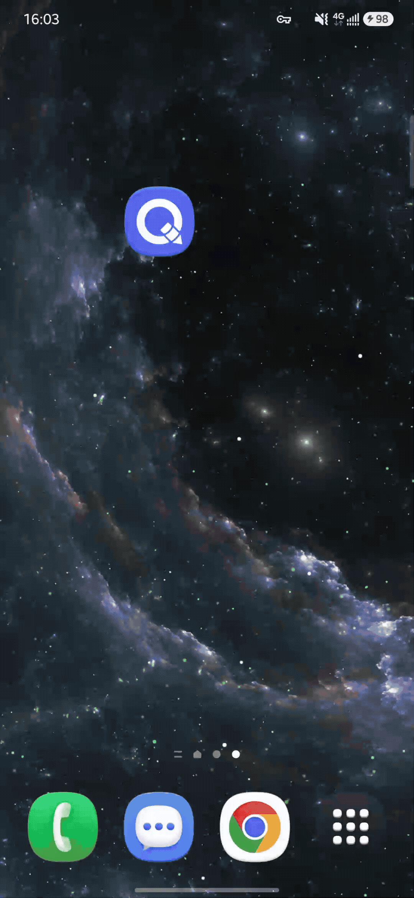
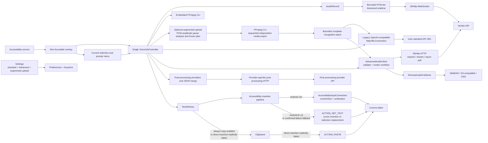
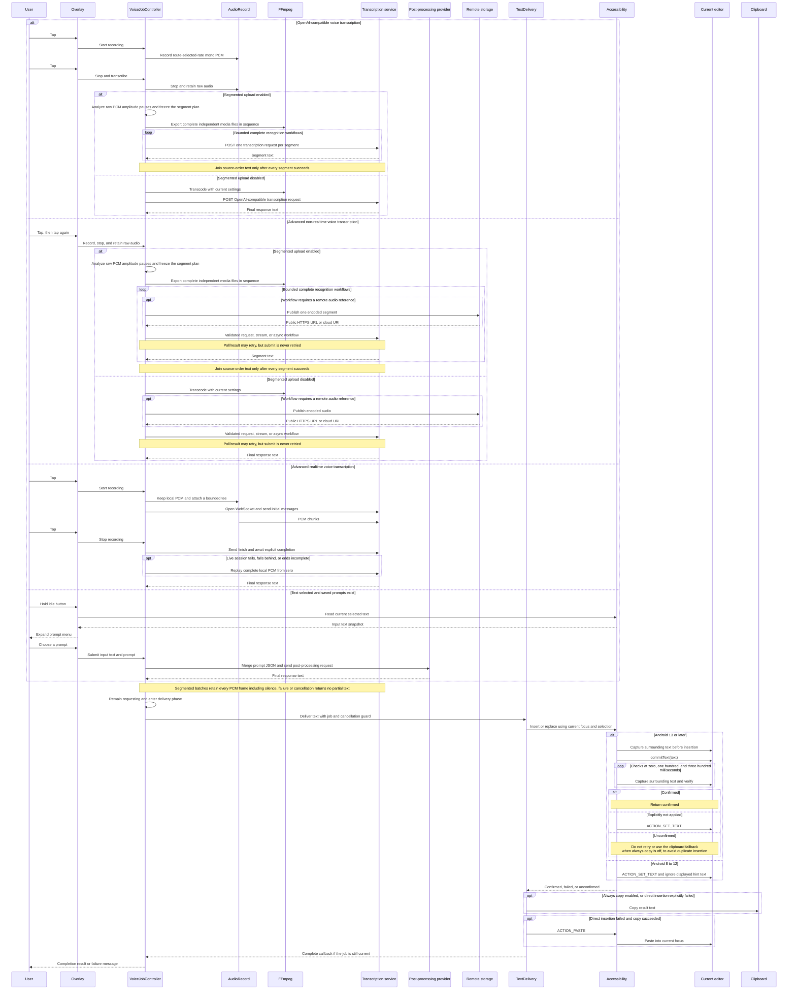
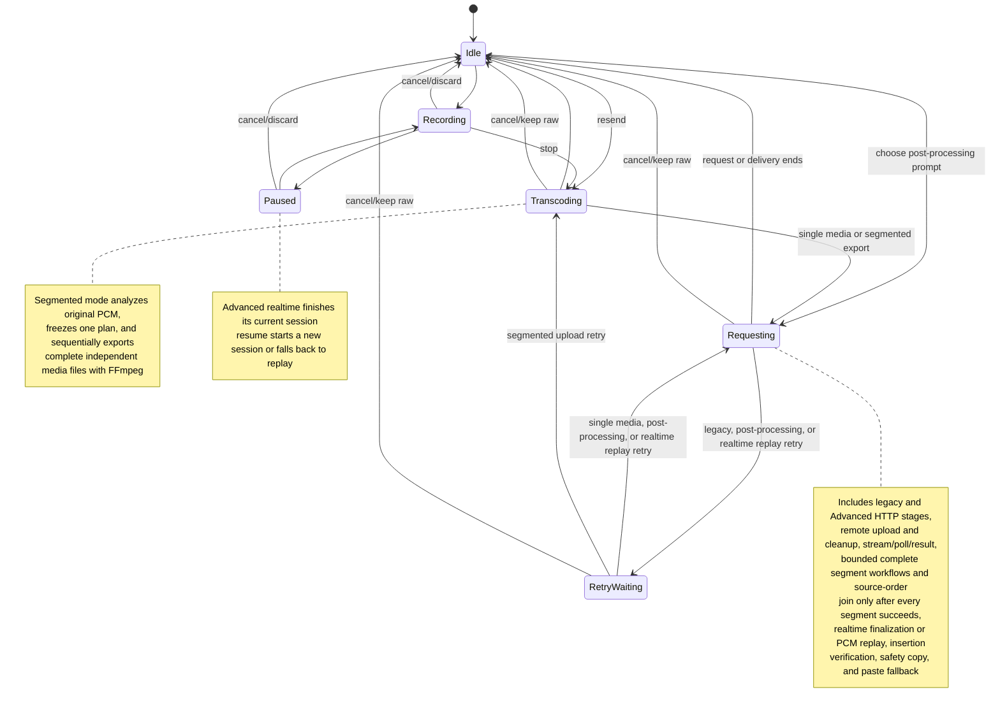

English | [简体中文](README_ZH.md)

# Dictate

Dictate is an Android speech transcription and selected-text post-processing tool operated through an accessibility floating button that does not steal focus. Audio or selected text is sent directly to the service specified by the user, with one task executed at a time. Transcription and post-processing share the same write rule: if there is no selection when writing, the text is inserted at the current cursor position; if there is an editable selection, that portion of text is replaced.

## Downloads

| Platform | Download | SHA-256 |
|---|---|---|
| arm64-v8a | [arm64-v8a](https://github.com/Joey-Kot/Dictate/releases/download/Latest/Dictate-latest-arm64-v8a.apk) | [sha256](https://github.com/Joey-Kot/Dictate/releases/download/Latest/Dictate-latest-arm64-v8a.apk.sha256) |

## Demo and Configuration

| [](demo/Demo-EN.gif) |
| :---: |
| **Dictate in action**<br>Use the floating button to transcribe speech, then select text and apply your own prompts to rewrite or translate it. |

| [](demo/1.%20Permissions.png) | [](demo/2.%20UI%20language.png) | [](demo/3.%20Audio%20Record%20Settings.png) |
| :---: | :---: | :---: |
| **1. Permissions**<br>Enable the accessibility service and grant microphone permission. | **2. UI language**<br>Choose English, Chinese, Japanese, German, French, or Russian, then save to apply. | **3. Audio Record Settings**<br>Choose the output sample rate, codec, container, and bitrate. |
| [](demo/4.%20Audio%20API%20Settings.png) | [](demo/5.%20Rewrite%20API%20Settings.png) | [](demo/6.%20Prompt%20Edit.png) |
| **4. Audio API Settings**<br>Set the transcription Base URL, API Key, model, and additional JSON parameters; test with a real transcription request. | **5. Rewrite API Settings**<br>Configure the text-processing provider, Base URL, API Key, and model; manage prompt order and test the connection. | **6. Prompt editor**<br>Set each prompt's provider, icon, title, instructions, and additional JSON; inherit the main Provider or configure and test an independent API. |
| [](demo/7.%20Segmented%20Upload%20Settings.png) | [](demo/8.%20Retry%20Settings.png) | [](demo/9.%20Interaction%20Settings.png) |
| **7. Segmented Upload Settings**<br>Enable pause-aware segmented upload and set the maximum segment length, minimum pause duration, and concurrent recognition workflows. | **8. Retry Settings**<br>Enable automatic retries and set the maximum retry count and initial delay. | **9. Interaction Settings**<br>Configure clipboard copying, the long-press threshold, and the maximum double-tap interval. |
| [](demo/10.%20Display%20Settings.png) | [](demo/11.%20Configuration%20Saving%20and%20Import%26Export.png) | [](demo/12.%20Advanced%20Audio%20API%20Settings.png) |
| **10. Display Settings**<br>Adjust the floating button's size, opacity, and state colors, and manage notification settings. | **11. Save, import, and export**<br>Save settings, import or export JSON configuration, and view or clear diagnostics. | **12. Advanced Custom Audio API Provider**<br>Generate and validate declarative ASR provider workflows from separate user requirements and vendor materials. It provides typed, conditional, single-select, and multi-select controls, and supports single requests, streamed responses, async polling, and WebSocket realtime transcription. |
| [](demo/13.%20Generate%20a%20workflow%20based%20on%20the%20requirements%20and%20the%20vendor%27s%20API%20documentation.png) | [](demo/14.%20Generated%20workflow%20JSON%20and%20summary.png) | [](demo/15.%20Configurable%20parameters%20dynamically%20generated%20according%20to%20user%20requirements.png) |
| **13. Generate workflow**<br>Paste vendor documentation or request examples, describe the parameters to use, and generate a custom Audio API Provider workflow. | **14. Workflow JSON and summary**<br>Review the generated JSON and summary. | **15. Dynamic parameters and secrets**<br>Workflow-declared typed controls appear after validation; Remote audio appears only when the workflow requires it. |
| [](demo/16.%20Configurable%20cloud%20storage%20or%20WebDAV.png) | [](demo/17.%20Successfully%20tested%20the%20workflow%20API.png) |  |
| **16. Remote audio configuration**<br>Configure WebDAV, S3-compatible, or Aliyun OSS when audio must be delivered by public URL or cloud URI. | **17. Workflow endpoint test**<br>Test the current workflow draft with its declared values and secrets against the real endpoint. |  |

## Introduction to the Audio Transcription Feature

- **Audio transcription**: Works outside the IME through a floating button that does not take focus. Supports pausing, canceling, and retranscribing the most recent recording, including with the screen off.
- **Text rewriting**: Configure prompts, providers, models, and parameters. After selecting text, long-press the floating button to choose and invoke a rewrite action.
- **Custom APIs**: Configure standard OpenAI-compatible audio APIs and Rewrite APIs from different providers, together with models, prompts, and additional request parameters.
- **Advanced Custom Audio API Provider**: Generate and validate declarative ASR Provider workflows from separate user requirements and vendor documentation. Provides typed controls, conditional visibility, single-select and multi-select controls, and supports one-shot requests, streamed responses, asynchronous polling, and real-time WebSocket transcription.
- **Segmented upload**: Optionally split long non-realtime ASR work into independent local batches. It uses raw PCM amplitude pauses without removing silence, exports complete media files sequentially through FFmpeg, and bounds concurrent recognition workflows. It supports standard OpenAI-compatible transcription and Advanced non-realtime workflows; realtime and Rewrite are excluded.
- **Automatic insertion**: Transcription and rewrite results are inserted at the active cursor or replace the current editable selection. A clipboard copy is retained by default; when that option is disabled, the clipboard is used only as a fallback after a confirmed write failure.
- **Audio processing**: Choose recording and output formats; FFmpeg is bundled, with no separate installation required.
- **Local concurrent segmented uploads**: Based on audio-amplitude silence analysis, uses pauses as preferred breakpoints while preserving the complete audio timeline, exports the audio as independent media chunks, and submits them to the ASR API with limited concurrency.
- **Task and configuration security**: Transcoding, network requests, and retries can all be canceled. API keys, workflows, and remote-storage credentials are encrypted with Android Keystore, with support for redacted diagnostics, live endpoint testing, and validated JSON import and export.

### Introduction to the selected-text processing feature

- Select text, hold the idle floating button, and choose a prompt from the menu to process the selection. With no selected text or no saved prompts, holding the button resends the previous recording.
- Configure Provider, Base URL, API Key, and Model independently under **Rewrite API Settings**. Supported providers are OpenAI-Compatible, OpenAI Responses, OpenAI Completions, Google, Anthropic, DeepSeek, Qwen, and GLM.
- Prompts default to **Same as main provider**, inheriting all Rewrite API settings. Each prompt can instead use its own Provider, Base URL, API Key, and Model, with a Test connection button that works before saving.
- Each prompt has an icon, title, instructions, and its own additional JSON parameters. Saved prompts can be edited, deleted, and reordered; choose from eight built-in icons or import SVG, PNG, or JPG.
- Per-prompt JSON overrides request fields, including the selected API's `model`. Nested objects merge recursively, arrays are replaced as a whole, other values overwrite existing values, and object fields explicitly set to `null` are removed from the request.
- Use your own prompts to polish, rewrite, translate, or summarize existing text or a completed transcription, without starting another recording.
- Post-processing preserves the previous recording. It shares transcription's processing state, double-tap cancellation, automatic retries, and write behavior: insert at the current cursor, or replace the editable selection present when writing.

### Floating button gestures

| State | Tap | Hold | Fast double tap |
|---|---|---|---|
| Idle | Record | Open the menu if text is selected and saved prompts exist; otherwise resend the previous recording | No action |
| Recording | Stop and transcribe | Pause | Cancel and discard |
| Paused | No action | Resume | Cancel and discard |
| Processing | No action | No action | Cancel the current task and retain existing audio |

Gesture precedence is `drag > hold > double tap > tap`. A hold is confirmed on release, so movement beyond the system touch threshold at any point before release always becomes a drag. A short tap is confirmed only after the configured double-tap window, so a fast double tap always has one unambiguous outcome.

The prompt menu expands smoothly from the button into a rounded, translucent, vertically scrolling panel. Tapping outside collapses it to the idle microphone button; choosing a prompt collapses it and enters processing. With no saved prompts, a hold resends the previous recording even when text is selected.

## Architecture


```mermaid
flowchart LR
  A["Accessibility service"] --> B["Non-focusable overlay"]
  B --> C["Single VoiceJobController"]
  B --> L["Current selection and prompt menu"]
  L --> C
  C --> D["AudioRecord"]
  C --> E["Embedded FFmpeg CLI"]
  C --> SU["Optional segmented upload<br/>PCM amplitude pause analysis and frozen plan"]
  SU --> SE["FFmpeg CLI<br/>sequential independent media export"]
  SE --> SB["Bounded complete recognition batch"]
  SB --> F
  SB --> AA
  C --> F["Legacy OpenAI-compatible<br/>HttpURLConnection"]
  F --> G["User standard API URL"]
  C --> AA["AdvancedAudioClient<br/>validate + render workflow"]
  AA --> OH["OkHttp HTTP<br/>request / stream / async poll"]
  OH --> V["Vendor API"]
  AA --> RA["RemoteAudioPublisher"]
  RA --> RS["WebDAV / S3-compatible / OSS"]
  D --> RT["Bounded PCM tee<br/>Advanced realtime"]
  RT --> WS["OkHttp WebSocket"]
  WS --> V
  C --> H["Post-processing providers and JSON merge"]
  H --> PH["Provider-specific post-processing HTTP"]
  PH --> PV["Post-processing provider API"]
  C --> T["TextDelivery"]
  T --> W["Accessibility insertion pipeline"]
  W -->|"Android 13+"| M["AccessibilityInputConnection<br/>commitText + verification"]
  W -->|"Android 8–12<br/>or confirmed-failure fallback"| S["ACTION_SET_TEXT<br/>cursor insertion or selection replacement"]
  M --> X["Current editor"]
  S --> X
  T -->|"always copy enabled<br/>or direct insertion explicitly failed"| I["Clipboard"]
  I -->|"direct insertion explicitly failed"| P["ACTION_PASTE"]
  P --> X
  J["Settings<br/>standard + Advanced + segmented upload"] --> K["Preferences + Keystore"]
```

## Request Sequence


```mermaid
sequenceDiagram
  participant U as User
  participant O as Overlay
  participant J as VoiceJobController
  participant R as AudioRecord
  participant F as FFmpeg
  participant V as Transcription service
  participant P as Post-processing provider
  participant S as Remote storage
  participant D as TextDelivery
  participant A as Accessibility
  participant E as Current editor
  participant C as Clipboard

  alt OpenAI-compatible voice transcription
    U->>O: Tap
    O->>J: Start recording
    J->>R: Record route-selected-rate mono PCM
    U->>O: Tap
    O->>J: Stop and transcribe
    J->>R: Stop and retain raw audio
    alt Segmented upload enabled
      J->>J: Analyze raw PCM amplitude pauses and freeze the segment plan
      J->>F: Export complete independent media files in sequence
      loop Bounded complete recognition workflows
        J->>V: POST one transcription request per segment
        V-->>J: Segment text
      end
      Note over J,V: Join source-order text only after every segment succeeds
    else Segmented upload disabled
      J->>F: Transcode with current settings
      J->>V: POST OpenAI-compatible transcription request
      V-->>J: Final response text
    end
  else Advanced non-realtime voice transcription
    U->>O: Tap, then tap again
    O->>J: Record, stop, and retain raw audio
    alt Segmented upload enabled
      J->>J: Analyze raw PCM amplitude pauses and freeze the segment plan
      J->>F: Export complete independent media files in sequence
      loop Bounded complete recognition workflows
        opt Workflow requires a remote audio reference
          J->>S: Publish one encoded segment
          S-->>J: Public HTTPS URL or cloud URI
        end
        J->>V: Validated request, stream, or async workflow
        Note over J,V: Poll/result may retry, but submit is never retried
        V-->>J: Segment text
      end
      Note over J,V: Join source-order text only after every segment succeeds
    else Segmented upload disabled
      J->>F: Transcode with current settings
      opt Workflow requires a remote audio reference
        J->>S: Publish encoded audio
        S-->>J: Public HTTPS URL or cloud URI
      end
      J->>V: Validated request, stream, or async workflow
      Note over J,V: Poll/result may retry, but submit is never retried
      V-->>J: Final response text
    end
  else Advanced realtime voice transcription
    U->>O: Tap
    O->>J: Start recording
    J->>R: Keep local PCM and attach a bounded tee
    J->>V: Open WebSocket and send initial messages
    R->>V: PCM chunks
    U->>O: Tap
    O->>J: Stop recording
    J->>V: Send finish and await explicit completion
    opt Live session fails, falls behind, or ends incomplete
      J->>V: Replay complete local PCM from zero
    end
    V-->>J: Final response text
  else Text selected and saved prompts exist
    U->>O: Hold idle button
    O->>A: Read current selected text
    A-->>O: Input text snapshot
    O-->>U: Expand prompt menu
    U->>O: Choose a prompt
    O->>J: Submit input text and prompt
    J->>P: Merge prompt JSON and send post-processing request
    P-->>J: Final response text
  end

  Note over J,V: Segmented batches retain every PCM frame including silence, failure or cancellation returns no partial text

  J->>J: Remain requesting and enter delivery phase
  J->>D: Deliver text with job and cancellation guard
  D->>A: Insert or replace using current focus and selection

  alt Android 13 or later
    A->>E: Capture surrounding text before insertion
    A->>E: commitText(text)

    loop Checks at zero, one hundred, and three hundred milliseconds
      A->>E: Capture surrounding text and verify
    end

    alt Confirmed
      Note over A,E: Return confirmed
    else Explicitly not applied
      A->>E: ACTION_SET_TEXT
    else Unconfirmed
      Note over A,E: Do not retry or use the clipboard fallback<br/>when always-copy is off, to avoid duplicate insertion
    end

  else Android 8 to 12
    A->>E: ACTION_SET_TEXT and ignore displayed hint text
  end

  A-->>D: Confirmed, failed, or unconfirmed

  opt Always copy enabled, or direct insertion explicitly failed
    D->>C: Copy result text
  end

  opt Direct insertion failed and copy succeeded
    D->>A: ACTION_PASTE
    A->>E: Paste into current focus
  end

  D-->>J: Complete callback if the job is still current
  J-->>U: Completion result or failure message
```

Post-processing captures selected text before opening the menu as its input. Both task types resolve the output target at write time; neither binds output to the field or selection present when the request began. Moving the cursor, changing selection, or switching editors while waiting changes where the result is delivered. Both use the same verification and clipboard fallback.

## Job state machine


```mermaid
stateDiagram-v2
  [*] --> Idle
  Idle --> Recording
  Idle --> Transcoding: resend
  Idle --> Requesting: choose post-processing prompt
  Recording --> Paused
  Paused --> Recording
  Recording --> Transcoding: stop
  Transcoding --> Requesting: single media or segmented export
  Requesting --> RetryWaiting: legacy, post-processing, or realtime replay retry
  RetryWaiting --> Requesting: single media, post-processing, or realtime replay retry
  RetryWaiting --> Transcoding: segmented upload retry
  Requesting --> Idle: request or delivery ends
  Transcoding --> Idle
  Recording --> Idle: cancel/discard
  Paused --> Idle: cancel/discard
  Transcoding --> Idle: cancel/keep raw
  Requesting --> Idle: cancel/keep raw
  RetryWaiting --> Idle: cancel/keep raw
  note right of Requesting
    Includes legacy and Advanced HTTP stages,
    remote upload and cleanup, stream/poll/result,
    bounded complete segment workflows and source-order
    join only after every segment succeeds,
    realtime finalization or PCM replay, insertion
    verification, safety copy, and paste fallback
  end note
  note right of Transcoding
    Segmented mode analyzes original PCM,
    freezes one plan, and sequentially exports
    complete independent media files with FFmpeg
  end note
  note right of Paused
    Advanced realtime finishes its current session
    resume starts a new session or falls back to replay
  end note
```

Internal task states remain idle, recording, paused, transcoding, requesting, and retry waiting. Advanced HTTP stages reuse requesting; their phase-level retries never enter retry waiting or resubmit an async task. Realtime PCM replay retries use retry waiting and restart from byte zero. The menu is an idle presentation state and starts no request. Post-processing enters requesting directly, without recording or transcoding; success, failure, and cancellation do not replace the previous recording.

## Requirements

- Android 8.0+ (`minSdk 26`) on an `arm64-v8a` device.
- Enabled Dictate accessibility service; recording additionally needs microphone permission.
- Transcription needs either an OpenAI-compatible `POST /v1/audio/transcriptions` endpoint, Base URL, API Key, and model, or an enabled validated Advanced Audio API workflow with its declared values and secrets.
- Post-processing needs valid Provider, Base URL, API Key, and model settings, either shared or configured per prompt, and at least one saved prompt.

Selection reading and text delivery depend on the target application's accessibility support. Read-only selections can supply post-processing input; password fields, protected screens, and custom controls may hide selections or reject writing. The existing clipboard fallback handles unavailable editable focus. Dictate does not contain per-app compatibility logic.

On Android 13 and newer, when accessibility nodes do not expose selected text, Dictate also queries the current editor's input connection in the background before choosing between the prompt menu and resending audio. This does not change the clipboard. Results are discarded if the editor, selection, or active task changes during the read.

## Build from source

Use JDK 17, Android SDK Platform 35, Build Tools 35.0.0, and NDK `27.2.12479018`.

```bash
export ANDROID_HOME=/path/to/android-sdk
export ANDROID_NDK_HOME="$ANDROID_HOME/ndk/27.2.12479018"
export GRADLE_USER_HOME=/tmp/gradle-user-home
./gradlew :app:assembleDebug
```

`assembleDebug` automatically runs `scripts/build-android-ffmpeg.sh` when its arm64 FFmpeg binary is missing or the script has changed, then packages the result at `app/src/main/jniLibs/arm64-v8a/libffmpeg.so`. This requires an installed Android NDK exposed through `ANDROID_NDK_HOME` or `ANDROID_NDK_ROOT`; the generated binary is reused by unchanged Debug builds. The script remains available for an explicit native-only rebuild. Signed releases additionally use `ANDROID_KEYSTORE_PATH`, `ANDROID_KEYSTORE_PASSWORD`, `ANDROID_KEY_ALIAS`, and `ANDROID_KEY_PASSWORD`.

Release builds enable R8 code shrinking, optimization, obfuscation, and resource shrinking. CI archives `mapping.txt` as a workflow artifact for recovering original crash stack traces. Debug builds remain unminified.

The native build requires Linux, `make`, `pkg-config`, `curl`, `tar`, and XZ support. The script verifies the FFmpeg `8.1`, Opus `1.5.2`, LAME `3.100`, libogg `1.3.5`, libvorbis `1.3.7`, OpenCORE AMR `0.1.6`, VisualOn AMR-WB `0.1.3`, and Speex `1.2.1` source archives by SHA-256. It builds only AArch64, checks every required demuxer/encoder/muxer/filter, and verifies the resulting Android PIE executable's 16 KiB load alignment. This FFmpeg build uses `--enable-gpl --enable-version3`; dependency licenses and checksums are recorded in [THIRD_PARTY_LICENSES.md](THIRD_PARTY_LICENSES.md).

After the native build, audio integration tests can run the packaged Android binary under QEMU with the Android 8 runtime. They require `qemu-user` (`qemu-aarch64`), `e2fsprogs` (`debugfs`), Python 3, and a host C compiler. The script extracts the runtime without mounting the SDK image and builds an independent FFmpeg 8.1 decoder/probe from the downloaded sources.

```bash
"$ANDROID_HOME/cmdline-tools/latest/bin/sdkmanager" 'system-images;android-26;default;arm64-v8a'
DICTATE_AUDIO_FULL=1 ./scripts/test-android-audio.sh
./gradlew :app:testDebugUnitTest :app:lintDebug
```

The full audio matrix checks every offered codec/container, sample-rate preset, and selectable bit depth, using default/minimum/maximum bitrates and every AMR/Speex mode. It checks decoded audio, stream metadata, raw PCM size/byte order, and exact mono duplication into two and six channels. CI runs this matrix before release packaging. QEMU validation does not replace microphone and device testing.

The packaged connectivity-test clip is a synthetic 16 kHz mono rendering of the word “test”, generated from Flite `2.2`'s `cmu_us_slt` voice. Its reproducible generation command is in `scripts/generate-connectivity-test-audio.sh`; provenance and the CMU notice are recorded in `THIRD_PARTY_LICENSES.md`.

GitHub release signing uses these repository secrets:

```text
ANDROID_KEYSTORE_BASE64
ANDROID_KEYSTORE_PASSWORD
ANDROID_KEY_ALIAS
ANDROID_KEY_PASSWORD
```

GitHub Actions is the default release path. Pushes to `main` and `dev`, plus manual dispatches with an optional ref, build a signed arm64 APK, generate the standard SHA-256 file, force-update the `Latest` tag, delete old Release assets, and upload only the current pair. One shared concurrency group prevents an older overlapping build from replacing a newer `Latest` publication.

## How to use (Configure)

1. Grant microphone permission and enable Dictate in Android accessibility settings. Notifications can be enabled or disabled from the switch in **Display Settings**.
2. For the usual route, enter Base URL (`https://example.com` or `https://example.com/v1`), API Key, and model. Alternatively, enable **Advanced Audio API Settings**, paste or generate a validated workflow, and fill its declared values and secrets.
3. The usual route can optionally add a complete JSON object using the merge rules below. Objects and arrays are serialized as JSON multipart field values, and `model` can be overridden. `file` is the binary audio attachment, so an additional field with that name reports a conflict.
4. Run the real endpoint test. The usual route transcodes an embedded short spoken clip and calls the transcription endpoint—not `/v1/models`; Advanced uses the current workflow draft and its values and secrets.
5. Optionally set the floating button's size, opacity, and a preset or custom three-state color scheme; then save, keep a cursor in an ordinary editable field, and use the floating button.

The Language section appears above Audio Record Settings. It defaults to English, regardless of the system language, and offers English, 中文, 日本語, Deutsch, Français, and Русский in that order. Choose a language and tap Save settings to apply it to the interface, dialogs, status messages, and recording notifications. This setting does not change the transcription language or user-supplied prompts and API parameters.

The settings sections have no numbers: Audio Record Settings, Audio API Settings, Rewrite API Settings, Advanced Audio API Settings, Segmented Upload Settings, Retry Settings, Interaction Settings, and Display Settings. Titles are translated into the selected interface language. About at the bottom lists the author, email, license, repository, and the installed build's version.

The notification switch reflects the system's actual app and recording-channel settings. Tap it to open system notification settings; its state refreshes when you return. Disabling notifications does not stop recording. On Android 13 and newer, the system may still show the running foreground service in its task manager even when notification-drawer notifications are disabled. This system setting is not part of exported app configuration.

### Advanced Audio API settings

Enable this opt-in mode when the usual OpenAI-compatible transcription route does not cover a provider's protocol. Paste a compatible declarative workflow, or describe the requirement and provide vendor documentation or request examples to generate one. Validate and apply the workflow before filling its dynamically generated values and secrets.

Remote audio settings appear only when the validated workflow delivers audio by public HTTPS URL or cloud URI. Choose WebDAV, S3-compatible storage, or Aliyun OSS when required. **Test workflow** uses the current, unsaved draft together with its declared values and secrets against the real endpoint.

### Segmented Upload Settings

This option is off by default. Its defaults are a maximum segment length of 495 seconds, a minimum pause duration of 700 ms, and one concurrent recognition workflow. It applies to normal OpenAI-compatible transcription and Advanced non-realtime `request`, `request_stream`, and `async_poll` workflows, retaining every supported non-realtime delivery form: `multipart_file`, `raw_audio`, `base64`, `data_uri`, `public_https_url`, `cloud_uri`, and `provider_upload`. It does not apply to Advanced realtime sessions or Rewrite.

The planner analyzes original PCM amplitude, selects pauses near the configured upper limit, and preserves every PCM frame, including silence. When no suitable pause exists before the limit, it cuts at the limit. FFmpeg sequentially exports each contiguous interval as a complete independent media file; the concurrency setting limits complete recognition workflows, not local encoding.

Text is directly concatenated in source order only after every segment succeeds. A failure or cancellation cancels outstanding work and delivers no partial transcript. The first segmented attempt freezes its plan and segmentation parameters; automatic retries and retranscription of the latest recording re-export the original PCM with that plan instead of analyzing pauses again.

### Audio encoding settings

Recording stays at 16-bit mono PCM at the active route's capture rate. FFmpeg converts the sample format/bit depth and resamples when encoding. All currently offered encoders accept mono; if an encoder requires more channels, the conversion path copies the source into every channel of its smallest supported layout.

The default remains MP3, automatic sample rate, and 128 kbps. Automatic mode selects the nearest supported rate to the capture rate capped at 48 kHz, preferring the lower rate on a tie. If the saved bitrate is incompatible with that rate, the current recording uses the encoder's default bitrate for the resolved rate; saved preferences are retained. Manual rate presets are 7.35, 8, 11.025, 12, 16, 22.05, 24, 32, 44.1, 48, 64, 88.2, 96, 176.4, and 192 kHz, filtered by encoder.

| Encoding choice | Output containers | Rate/depth restrictions |
|---|---|---|
| Opus | OPUS, OGG, WEBM, MP4, MKV, MKA | 8 / 12 / 16 / 24 / 48 kHz |
| MP3 | MP3, WAV, AVI, MKV, MKA, MPEG; MP4/FLV where supported | Presets from 8–48 kHz; see container restrictions below |
| AAC | M4A, MP4, AAC (ADTS), FLV, MKV, MKA, MOV | Presets up to 96 kHz; AAC/WAV is excluded because it cannot reliably round-trip |
| Vorbis | OGG, WEBM, MKV, MKA | Presets from 8–48 kHz |
| FLAC | FLAC, OGG, MKV, MKA | 16 / 24-bit output |
| ALAC | M4A, MP4, MOV | 16 / 24-bit output |
| AC-3 | AC3, M4A, MP4, WAV, AVI, MKV, MKA, MPEG | 32 / 44.1 / 48 kHz |
| E-AC-3 | EAC3, MP4, MKV, MKA | 32 / 44.1 / 48 kHz |
| MP2 | WAV, MP4, MPEG | 16 / 22.05 / 24 / 32 / 44.1 / 48 kHz |
| ADPCM (MS) | WAV | Converted from PCM16 |
| AMR-NB | AMR, WAV | 8 kHz; exact 4.75–12.2 kbps modes |
| AMR-WB | AMR | 16 kHz; exact 6.6–23.85 kbps modes |
| Speex | SPX, OGG | 8 / 16 / 32 kHz; exact bitrate modes for the selected rate |
| WavPack | WV | 16 / 24 / 32-bit output |
| WMA v1 / v2 | WMA, ASF | Presets from 8–48 kHz |
| PCM | WAV; MP4, MOV and matching S16LE/S24LE/S32LE raw output for 16/24/32-bit; AVI for 16-bit | 8 / 16 / 24 / 32-bit; unsigned 8-bit uses WAV |
| PCM 8-bit (signed) | AIFF, S8 | Fixed signed 8-bit |
| PCM A-law / μ-law | WAV, matching ALAW/MULAW raw output | Fixed companded format |
| PCM Float 32/64-bit (LE) | WAV, MP4, matching F32LE/F64LE raw output | Fixed floating-point format |
| PCM 64-bit (LE) | WAV | Fixed signed 64-bit |
| PCM 16/24/32-bit (BE) | AIFF, MP4, matching S16BE/S24BE/S32BE raw output | Fixed big-endian integer format |
| PCM Float 32/64-bit (BE) | AIFF, MP4, matching F32BE/F64BE raw output | Fixed big-endian floating-point format |

MP3 in MP4 requires at least 16 kHz. MP3 in FLV is offered only at 11.025, 22.05, 44.1, or 48 kHz. Automatic MP3 mode offers the common container set without MP4/FLV so an input-route change preserves the selected container. Encoders without a rate restriction in the table use the full preset list.

Bit-depth controls appear for PCM, FLAC, ALAC, and WavPack; target-bitrate controls appear only for encoders that use them. Bitrates are stored and passed to FFmpeg in exact bits per second, so values such as AMR-NB 4.75 kbps and AMR-WB 23.85 kbps are preserved. Container extension and upload MIME type come from the resolved encoding settings, including `audio/amr-wb` for AMR-WB and `application/octet-stream` for raw PCM.

This table describes local output support. The configured transcription service must also accept the chosen encoding, container, and sample rate. Raw PCM has no format header; its receiver needs the matching sample format, rate, and channel count. Use the endpoint test with the intended settings to check service compatibility.

### Post-processing configuration

Shared fields are Provider, Base URL, API Key, and Model, followed by Add prompt, the saved prompt list, and Test connection. Providers are OpenAI-Compatible, OpenAI Responses, OpenAI Completions, Google, Anthropic, DeepSeek, Qwen, and GLM. OpenAI Completions uses `/chat/completions`. Saved instructions use the provider's system/developer instruction level; selected text supplies the user input.

Add a prompt or tap an existing entry to edit its Provider, icon, title, instructions, and additional JSON. Saving the dialog immediately persists that prompt and its independent API Key. Titles, instructions, and additional JSON are validated when saving; API fields may be incomplete and are checked when testing or executing. Existing entries can be deleted in the dialog or reordered with the list's up/down buttons. Shared fields use the main Save settings button.

New prompts and prompts saved before this feature default to **Same as main provider**. Here, “main” means the shared **Rewrite API Settings**, including the entire Provider, Base URL, API Key, and Model configuration. Selecting a specific Provider uses only that prompt's API fields, even when its Provider matches the main Provider; empty fields do not fall back to shared values. Switching back to inheritance hides and retains the independent fields and key without using them for requests.

Choose from eight built-in icons or import SVG, PNG, or JPG. Custom icons are copied into private app storage, limited to 1 MiB each and 8 MiB total. Configuration exports carry referenced icons; unavailable or invalid images fall back to a built-in icon.

The shared Test connection button sends a minimal text request using the current shared fields and follows Retry Settings. Transcription and normal prompt execution also follow those settings. Each prompt execution resolves its API settings once; changing settings while it runs does not change the API, input, additional JSON, or retry parameters for that task.

Selecting an independent Provider reveals a Test connection button inside the prompt editor. It tests the current, unsaved Provider, Base URL, API Key, and Model with fixed minimal instructions and input, ignoring the prompt's title, instructions, and additional JSON. It sends one request with no automatic retries and displays the result without saving or writing to the editor or clipboard. Editing API fields or changing Provider, closing the dialog, or destroying the activity cancels that test. Screen rotation retains the draft and cancels the test without restarting it. The shared connection test likewise does not write to the editor or clipboard.

### Additional JSON merging

Use a JSON object, or leave the field empty. The app constructs a base request, then applies additional JSON: objects merge recursively, arrays replace whole arrays, and other values override matching fields at the same level. An additional object field set to `null` deletes that field, including when it did not previously exist. A `null` array element remains an array value. Saving, editing, and exporting retain deletion instructions; deletion happens only while building a request.

For example, this per-prompt configuration selects `another-model` and removes `temperature` from the base request:

```json
{
  "model": "another-model",
  "temperature": null,
  "metadata": { "task": "summary" }
}
```

The Model from the selected shared or independent API configuration is a default; validation uses the model after merging. Google's final model is used in its request URL. Additional fields must follow the selected provider's API format; deleting a required field can produce a configuration or server error.

Exports use `schemaVersion: 8`, with exact `audioOutput.bitrateBps`, the interface `language` tag, post-processing settings, ordered prompts with optional independent API settings, custom icons, and non-secret `advancedAudio` and `segmentedUpload` settings. A prompt's `provider` is `null` for inheritance; independent configurations store `provider`, `baseUrl`, and `model`. Imports accept versions 1–8. Versions 7 and 8 require `advancedAudio`; version 8 also requires `segmentedUpload`. Versions 1–7 initialize segmented upload as disabled with 495 seconds, 700 ms, and concurrency 1. Versions 1–4 have their `bitrateKbps` converted to bits per second. Existing PCM/WAV settings, including unsigned 8-bit output, are retained. Legacy Opus selections of 32/44.1 kHz migrate to 48 kHz, matching their previous encoded output. Versions 1–3 default to an empty prompt list; prompts without a `provider` inherit the main API, and configurations without a `language` field default to English. Invalid encoding combinations are rejected before applying an import.

The clipboard safety copy is enabled by default. Turning it off restores fallback-only behavior: Dictate copies only when current-focus insertion explicitly fails. An unconfirmed insertion is never retried or copied automatically in that mode, because it may still have reached the editor.

Use HTTPS. Audio and selected text go directly to their configured Base URLs. Dictate provides no API, proxy, or account system. Transcription, shared Rewrite API, independent prompt API Keys, and Advanced Audio workflow or remote-storage secrets are separately encrypted using an AES key held by Android Keystore and omitted from exports. Prompt keys follow stable prompt IDs through renaming and reordering and are removed when their prompt is deleted.

Importing any key, including a prompt's optional `apiKey` or an `advancedAudio.secrets` map, requires explicit confirmation. When an imported prompt omits `apiKey`, an existing key is retained only if its ID, Provider, and Base URL (after trimming surrounding whitespace) all match; otherwise its key is empty. An explicitly empty `apiKey` clears the stored key. When `advancedAudio.secrets` is omitted, existing Advanced Audio secrets are retained only when the non-secret `advancedAudio` configuration is unchanged; otherwise they are cleared.

## License

`GPL-3.0-or-later`. See [LICENSE](LICENSE), [NOTICE](NOTICE), and [THIRD_PARTY_LICENSES.md](THIRD_PARTY_LICENSES.md).
