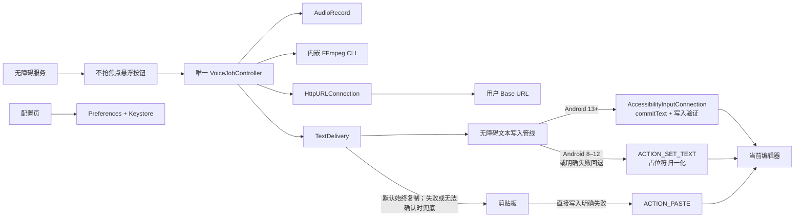
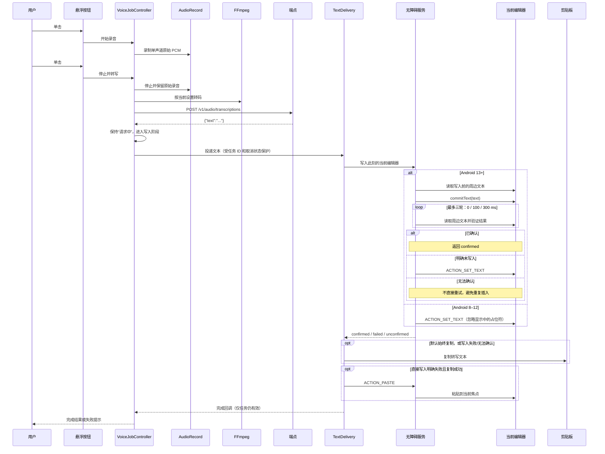
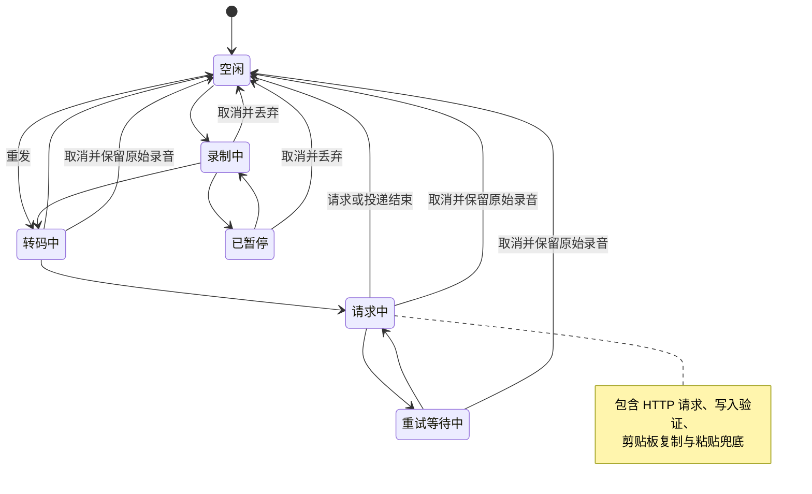

[English](README.md) | 简体中文

# Dictate

Dictate 是 Android 语音转写增强层，不是输入法。它显示一个不抢焦点的无障碍悬浮按钮，处理唯一语音任务，将音频直接发送到用户配置的 OpenAI Compatible 端点，并把响应顶层 `text` 插入响应到达时存在的当前可编辑焦点。

https://github.com/user-attachments/assets/2be67e90-1639-4ceb-94db-c9c510f2d183

## 功能

- 不实现 IME、键盘、候选栏、编辑上下文、历史列表、云账号或代理服务。
- `AudioRecord` PCM 录音，支持暂停/恢复、前台麦克风服务、唤醒锁和取消。
- 无障碍悬浮按钮不抢焦点，可实时拖动并保存位置；恢复时会按系统边距、刘海和可见屏幕重新裁剪，拖动不改变当前语音任务。
- 已开始的录音在熄屏后继续；不提供锁屏控制或锁屏上屏。
- 从源码构建 FFmpeg `n8.1`、Opus `1.5.2`、LAME `3.100`，只支持 `arm64-v8a`。
- 支持 Opus、MP3、AAC、PCM/WAV，只展示有效编码与容器组合。
- 直接 multipart 请求 OpenAI Compatible `/v1/audio/transcriptions`；成功响应必须含顶层非空字符串 `text`。
- 写入完成时的当前焦点，并默认始终保留剪贴板副本；关闭该开关后，剪贴板恢复为写入失败时的兜底。
- FFmpeg、HTTP 和指数退避等待均可取消，所有回调受递增任务 ID 保护。
- Keystore 支持的 API Key 加密、脱敏诊断、真实端点测试、完整校验的 JSON 导入导出。

| 状态 | 单击 | 长按 | 快速双击 |
|---|---|---|---|
| 空闲 | 录制 | 重发上一条 | 无操作 |
| 录制中 | 停止并转写 | 暂停 | 取消并丢弃 |
| 已暂停 | 无操作 | 恢复 | 取消并丢弃 |
| 处理中 | 无操作 | 无操作 | 取消并保留原始录音 |

手势优先级固定为 `拖拽 > 长按 > 双击 > 单击`。长按在抬起时确认，因此只要抬起前任何时刻的移动超过系统触摸阈值，本次触摸就只会被判为拖动。短按会等待配置的双击判定窗口后再确认，保证快速双击始终只有一个明确结果。

## 下载

| Platform | Download | SHA-256 |
|---|---|---|
| arm64-v8a | [arm64-v8a](https://github.com/Joey-Kot/Dictate/releases/download/Latest/Dictate-latest-arm64-v8a.apk) | [sha256](https://github.com/Joey-Kot/Dictate/releases/download/Latest/Dictate-latest-arm64-v8a.apk.sha256) |

## 架构



## 请求流程



应用从不保存录制开始时的输入框、App、光标或选区，只在有效响应到达后取得当前焦点。

## 任务状态机



内部状态严格只有空闲、录制中、已暂停、转码中、请求中和重试等待中。

## 使用要求

- Android 8.0+（`minSdk 26`）和 `arm64-v8a` 设备。
- 麦克风权限及已启用的 Dictate 无障碍服务。
- OpenAI Compatible `POST /v1/audio/transcriptions` 端点、Base URL、API Key 和模型。

无障碍写入属于尽力支持。密码框、金融 App、游戏、受保护界面和自绘编辑器可能拒绝写入；项目不做逐 App 专项兼容。

## 从源码构建

使用 JDK 17、Android SDK Platform 35、Build Tools 35.0.0、NDK `27.2.12479018`。

```bash
export ANDROID_HOME=/path/to/android-sdk
export ANDROID_NDK_HOME="$ANDROID_HOME/ndk/27.2.12479018"
./scripts/build-android-ffmpeg.sh
./gradlew :app:assembleDebug
```

脚本生成 `app/src/main/jniLibs/arm64-v8a/libffmpeg.so`。签名 release 还需 `ANDROID_KEYSTORE_PATH`、`ANDROID_KEYSTORE_PASSWORD`、`ANDROID_KEY_ALIAS`、`ANDROID_KEY_PASSWORD`。

脚本会用 SHA-256 核验 FFmpeg `8.1`、Opus `1.5.2`、LAME `3.100` 的官方源码包，只构建 AArch64，逐项检查必需的 demuxer、编码器、容器和滤镜，并生成兼容 16 KiB 页面的 Android PIE 可执行文件 `libffmpeg.so`。

随 APK 分发的连通性测试音频是单词 “test” 的 16 kHz 单声道合成语音，使用 Flite `2.2` 的 `cmu_us_slt` 语音生成。可复现命令位于 `scripts/generate-connectivity-test-audio.sh`，来源与 CMU 许可记录在 `THIRD_PARTY_LICENSES.md`。

GitHub Release 签名使用以下仓库 Secrets：

```text
ANDROID_KEYSTORE_BASE64
ANDROID_KEYSTORE_PASSWORD
ANDROID_KEY_ALIAS
ANDROID_KEY_PASSWORD
```

GitHub Actions 是默认发布路径。推送到 `main`、`dev` 或使用可选 ref 手动触发后，会构建签名 arm64 APK、标准 SHA-256 文件，强制更新 `Latest` tag，删除 Release 旧附件并只上传当前两个文件。所有发布任务共用一个并发组，避免较旧的重叠构建反向覆盖较新的 `Latest`。

## 使用方法（配置）

1. 授予麦克风和通知权限，在 Android 无障碍设置中启用 Dictate。
2. 填写 Base URL（`https://example.com` 或 `https://example.com/v1`）、API Key 和模型。
3. 可选填写扁平 JSON multipart 参数；数组、嵌套对象、`null`、`file`、`model` 会被拒绝。
4. 执行真实端点测试；应用按当前音频设置转码内置短语音并调用转写端点，不使用 `/v1/models`。
5. 保存配置，在普通可编辑输入框中保留光标并使用悬浮按钮。

“始终复制到剪贴板”默认开启。关闭后恢复为仅兜底模式：只有当前焦点写入失败时才复制。

应使用 HTTPS。音频直接发送到配置的 Base URL；Dictate 不提供 API、代理、账号系统，也不保存用户 API 流量。API Key 使用 Android Keystore 中的 AES 密钥加密，默认导出不含密钥；导入密钥需要明确确认。

## 许可证

`GPL-3.0-or-later`。详见 [LICENSE](LICENSE)、[NOTICE](NOTICE)、[THIRD_PARTY_LICENSES.md](THIRD_PARTY_LICENSES.md)。
