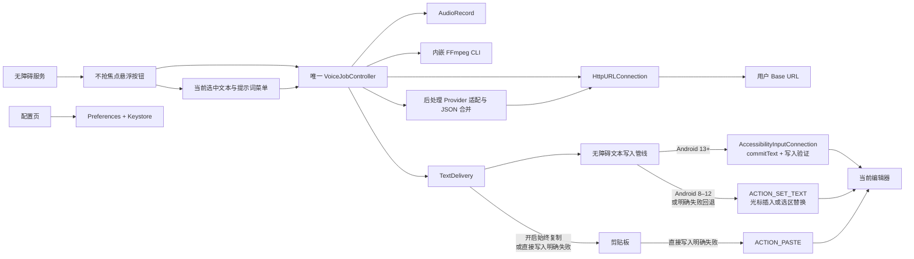
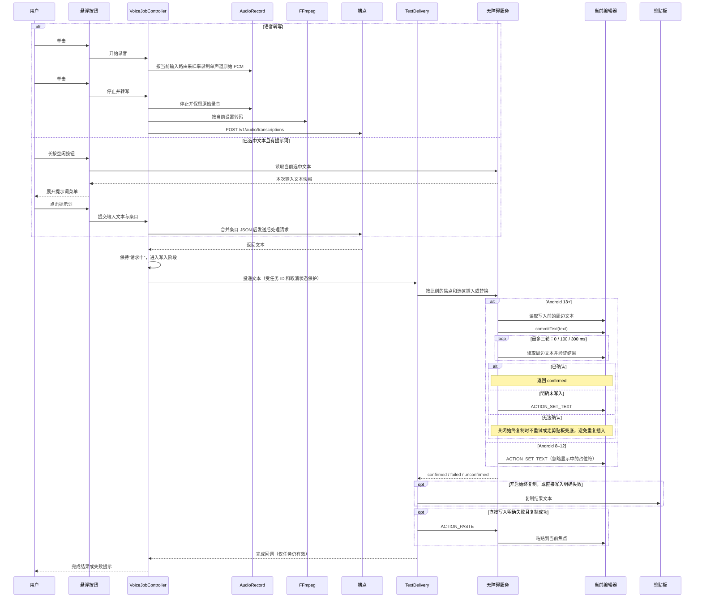
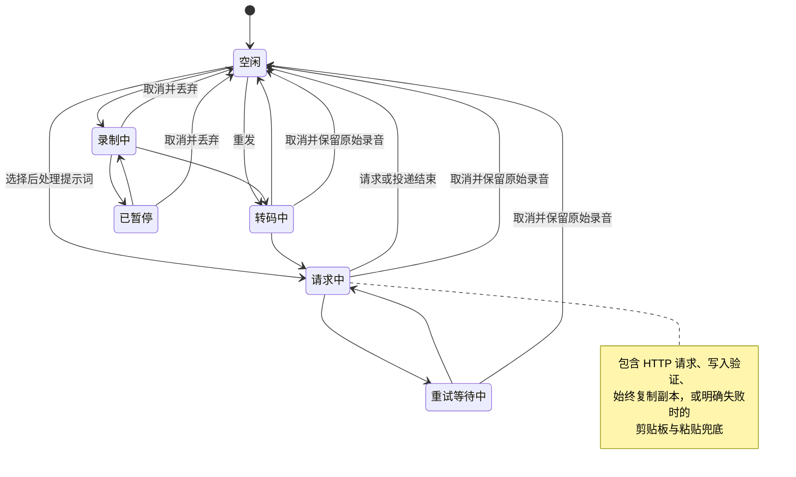

[English](README.md) | 简体中文

# Dictate

Dictate 是 Android 语音转写与选中文本后处理工具，通过不抢焦点的无障碍悬浮按钮操作。音频或选中文本直接发送到用户配置的指定服务，每次执行一个任务。转写和后处理共用同一个写入规则：实际写入时没有选区，就在当前光标处插入；有可编辑选区，就替换该段文本。

## 操作演示与配置

| [](demo/Demo-ZH.gif) |
| :---: |
| **实际操作**<br>通过悬浮按钮录音转写，再选中文本，使用自定义提示词进行改写、翻译等操作。 |

| [](demo/1.%20Permissions.png) | [](demo/2.%20UI%20language.png) |
| :---: | :---: |
| **1. 权限设置**<br>启用无障碍服务并授予麦克风权限。 | **2. 界面语言**<br>支持英语、中文、日语、德语、法语和俄语，选择后保存生效。 |
| [](demo/3.%20Audio%20Record%20Settings.png) | [](demo/4.%20Audio%20API%20Settings.png) |
| **3. 录音设置**<br>选择输出采样率、编码、容器和比特率。 | **4. 音频 API 设置**<br>配置转写服务的 Base URL、API Key、模型及附加 JSON 参数，并通过真实转写请求测试连接。 |
| [](demo/5.%20Rewrite%20API%20Settings.png) | [](demo/6.%20Prompt%20Edit.png) |
| **5. 改写 API 设置**<br>配置文本后处理的服务商、Base URL、API Key 和模型，管理提示词顺序并测试连接。 | **6. 提示词编辑**<br>设置每条提示词的图标、标题、内容及独立附加 JSON 参数，可单独覆盖模型等请求参数。 |
| [](demo/7.%20Retry%20Settings.png) | [](demo/8.%20Interaction%20Settings.png) |
| **7. 重试设置**<br>开启自动重试，设置最大重试次数和初始等待时间。 | **8. 交互设置**<br>设置是否始终复制结果到剪贴板，以及长按阈值和双击最大间隔。 |
| [](demo/9.%20Display%20Settings.png) | [](demo/10.%20Configuration%20Saving%20and%20Import%26Export.png) |
| **9. 显示设置**<br>调整悬浮按钮大小、不透明度和各状态颜色，并管理通知设置。 | **10. 配置保存与导入导出**<br>保存设置，通过 JSON 导入或导出配置，以及查看或清空诊断信息。 |

## 音频转录功能介绍

- 非 IME 形式，没有键盘、候选栏、历史列表、云账号或代理服务。
- `AudioRecord` PCM 录音：按当前输入路由选择采样率，固定 16-bit 单声道；支持暂停/恢复、前台麦克风服务、唤醒锁和取消。
- 无障碍悬浮按钮不抢焦点，可实时拖动并保存位置；可配置大小、不透明度，以及录制／暂停／处理中三种状态的预置或自定义色系，保存后无需重启无障碍服务；恢复时会按系统边距、刘海和可见屏幕重新裁剪，拖动不改变当前语音任务。
- 已开始的录音在熄屏后继续；不提供锁屏控制或锁屏上屏。
- 从源码构建 FFmpeg `n8.1`、Opus `1.5.2`、LAME `3.100`，目前只提供 `arm64-v8a` 预编译。
- 支持 Opus、MP3、AAC、PCM/WAV，只展示有效编码与容器组合；默认输出采样率跟随当前录音输入，最高 48 kHz。
- 直接 multipart 请求 OpenAI Compatible `/v1/audio/transcriptions`；成功响应必须含顶层非空字符串 `text`；目前暂不考虑支持 OpenAI Compatible 以外的其他 API，如有其他厂商服务需求，可使用任意兼容转换服务转换为 OpenAI Compatible 使用。
- 默认保留结果的剪贴板副本；关闭该开关后，只有明确写入失败才使用剪贴板兜底。
- FFmpeg、HTTP 和指数退避等待均可取消，所有回调受递增任务 ID 保护。
- Keystore 支持的 API Key 加密、脱敏诊断、真实端点测试、完整校验的 JSON 导入导出。

### 选中文本后处理功能介绍

- **选区操作菜单**：选中文本后长按空闲悬浮按钮，展开提示词列表，点击条目即可执行；没有选中文本或尚未保存提示词时，长按继续重发上一条录音。
- **独立服务配置**：在「改写 API 设置」中单独配置 Provider、Base URL、API Key 和 Model。支持 OpenAI-Compatible、OpenAI Responses、OpenAI Completions、Google、Anthropic、DeepSeek、Qwen、GLM。
- **自定义提示词与图标**：每项包含图标、标题、实际提示词及独立附加 JSON，支持新增、编辑、删除和排序。图标可使用 8 个内置选项，也可导入 SVG、PNG、JPG。
- **按提示词覆盖模型和参数**：各条目的附加 JSON 可覆盖公共 Model 及其他请求字段；嵌套对象逐层合并，数组整体替换，其他值直接覆盖，显式为 `null` 的对象字段在请求中删除。
- **按需处理文本**：通过自己编写的提示词，实现润色、改写、翻译、总结等操作；这些用途由用户配置，可处理已有文本或转写后的文本，无需先开始新的录音。
- **共用写入与任务控制**：后处理与转写共用处理中状态、双击取消及自动重试。结果按实际写入时的焦点和选区插入或替换；后处理完成、失败或取消均不替换上一条录音。

### 悬浮按钮操作

| 状态 | 单击 | 长按 | 快速双击 |
|---|---|---|---|
| 空闲 | 录制 | 有选中文本且提示词列表非空时展开菜单；其他情况重发上一条录音 | 无操作 |
| 录制中 | 停止并转写 | 暂停 | 取消并丢弃 |
| 已暂停 | 无操作 | 恢复 | 取消并丢弃 |
| 处理中 | 无操作 | 无操作 | 取消当前任务，保留已有录音 |

手势优先级固定为 `拖拽 > 长按 > 双击 > 单击`。长按在抬起时确认，因此只要抬起前任何时刻的移动超过系统触摸阈值，本次触摸就只会被判为拖动。短按会等待配置的双击判定窗口后再确认，保证快速双击始终只有一个明确结果。

提示词菜单是可纵向滚动的圆角半透明面板，从按钮位置平滑展开；点击菜单外区域收回空闲麦克风按钮。点击条目后收回圆形按钮并进入处理中状态。新安装或尚未添加提示词时，即使选中了文本，长按也继续重发上一条录音。

## 下载

| Platform | Download | SHA-256 |
|---|---|---|
| arm64-v8a | [arm64-v8a](https://github.com/Joey-Kot/Dictate/releases/download/Latest/Dictate-latest-arm64-v8a.apk) | [sha256](https://github.com/Joey-Kot/Dictate/releases/download/Latest/Dictate-latest-arm64-v8a.apk.sha256) |

## 架构


```mermaid
flowchart LR
  A["无障碍服务"] --> B["不抢焦点悬浮按钮"]
  B --> C["唯一 VoiceJobController"]
  B --> L["当前选中文本与提示词菜单"]
  L --> C
  C --> D["AudioRecord"]
  C --> E["内嵌 FFmpeg CLI"]
  C --> F["HttpURLConnection"]
  F --> G["用户 Base URL"]
  C --> H["后处理 Provider 适配与 JSON 合并"]
  H --> F
  C --> T["TextDelivery"]
  T --> W["无障碍文本写入管线"]
  W -->|"Android 13+"| M["AccessibilityInputConnection<br/>commitText + 写入验证"]
  W -->|"Android 8–12<br/>或明确失败回退"| S["ACTION_SET_TEXT<br/>光标插入或选区替换"]
  M --> X["当前编辑器"]
  S --> X
  T -->|"开启始终复制<br/>或直接写入明确失败"| I["剪贴板"]
  I -->|"直接写入明确失败"| P["ACTION_PASTE"]
  P --> X
  J["配置页"] --> K["Preferences + Keystore"]
```

## 请求流程


```mermaid
sequenceDiagram
  participant U as 用户
  participant O as 悬浮按钮
  participant J as VoiceJobController
  participant R as AudioRecord
  participant F as FFmpeg
  participant P as 端点
  participant D as TextDelivery
  participant A as 无障碍服务
  participant E as 当前编辑器
  participant C as 剪贴板
  alt 语音转写
    U->>O: 单击
    O->>J: 开始录音
    J->>R: 按当前输入路由采样率录制单声道原始 PCM
    U->>O: 单击
    O->>J: 停止并转写
    J->>R: 停止并保留原始录音
    J->>F: 按当前设置转码
    J->>P: POST /v1/audio/transcriptions
  else 已选中文本且有提示词
    U->>O: 长按空闲按钮
    O->>A: 读取当前选中文本
    A-->>O: 本次输入文本快照
    O-->>U: 展开提示词菜单
    U->>O: 点击提示词
    O->>J: 提交输入文本与条目
    J->>P: 合并条目 JSON 后发送后处理请求
  end
  P-->>J: 返回文本
  J->>J: 保持“请求中”，进入写入阶段
  J->>D: 投递文本（受任务 ID 和取消状态保护）
  D->>A: 按此刻的焦点和选区插入或替换
  alt Android 13+
    A->>E: 读取写入前的周边文本
    A->>E: commitText(text)
    loop 最多三轮：0 / 100 / 300 ms
      A->>E: 读取周边文本并验证结果
    end
    alt 已确认
      Note over A,E: 返回 confirmed
    else 明确未写入
      A->>E: ACTION_SET_TEXT
    else 无法确认
      Note over A,E: 关闭始终复制时不重试或走剪贴板兜底，避免重复插入
    end
  else Android 8–12
    A->>E: ACTION_SET_TEXT（忽略显示中的占位符）
  end
  A-->>D: confirmed / failed / unconfirmed
  opt 开启始终复制，或直接写入明确失败
    D->>C: 复制结果文本
  end
  opt 直接写入明确失败且复制成功
    D->>A: ACTION_PASTE
    A->>E: 粘贴到当前焦点
  end
  D-->>J: 完成回调（仅任务仍有效）
  J-->>U: 完成结果或失败提示
```

后处理在展开菜单前捕获选中文本作为本次输入。转写与后处理的输出位置都在实际写入时确定，不绑定请求开始时的输入框或选区；等待期间更换输入框、光标或选区后，使用写入时的状态。两类任务沿用同一套写入验证和剪贴板兜底策略。

## 任务状态机


```mermaid
stateDiagram-v2
  [*] --> 空闲
  空闲 --> 录制中
  空闲 --> 转码中: 重发
  空闲 --> 请求中: 选择后处理提示词
  录制中 --> 已暂停
  已暂停 --> 录制中
  录制中 --> 转码中
  转码中 --> 请求中
  请求中 --> 重试等待中
  重试等待中 --> 请求中
  请求中 --> 空闲: 请求或投递结束
  转码中 --> 空闲
  录制中 --> 空闲: 取消并丢弃
  已暂停 --> 空闲: 取消并丢弃
  转码中 --> 空闲: 取消并保留原始录音
  请求中 --> 空闲: 取消并保留原始录音
  重试等待中 --> 空闲: 取消并保留原始录音
  note right of 请求中
    包含 HTTP 请求、写入验证、
    始终复制副本，或明确失败时的
    剪贴板与粘贴兜底
  end note
```

内部任务状态仍为空闲、录制中、已暂停、转码中、请求中和重试等待中。菜单展开属于空闲时的界面状态，不启动请求。后处理直接进入请求中，跳过录音和转码；完成、失败或取消均不替换上一条录音。

## 使用要求

- Android 8.0+（`minSdk 26`）和 `arm64-v8a` 设备。
- 已启用的 Dictate 无障碍服务；录音还需要麦克风权限。
- 转写需要 OpenAI Compatible `POST /v1/audio/transcriptions` 端点、Base URL、API Key 和模型。
- 后处理需要独立的 Provider、Base URL、API Key、模型配置及至少一条提示词。

选区读取及无障碍写入依赖目标应用提供的能力。只读文本可以作为后处理输入；密码框、受保护界面和自绘控件可能不暴露选区或拒绝写入。无可写入焦点时沿用剪贴板兜底，项目不做逐 App 专项兼容。

Android 13 及以上版本在无障碍节点未提供选中文本时，还会通过当前编辑器的输入连接在后台读取选区，再决定展开提示词菜单还是重发录音。读取不会改变剪贴板；等待期间若编辑器、选区或当前任务发生变化，则丢弃过期结果。

## 从源码构建

使用 JDK 17、Android SDK Platform 35、Build Tools 35.0.0、NDK `27.2.12479018`。

```bash
export ANDROID_HOME=/path/to/android-sdk
export ANDROID_NDK_HOME="$ANDROID_HOME/ndk/27.2.12479018"
export GRADLE_USER_HOME=/tmp/gradle-user-home
./scripts/build-android-ffmpeg.sh
./gradlew :app:assembleDebug
```

脚本生成 `app/src/main/jniLibs/arm64-v8a/libffmpeg.so`，语音转写运行时需要此文件；仅完成 Gradle Debug 构建不会自动生成 FFmpeg。签名 release 还需 `ANDROID_KEYSTORE_PATH`、`ANDROID_KEYSTORE_PASSWORD`、`ANDROID_KEY_ALIAS`、`ANDROID_KEY_PASSWORD`。

Release 构建启用 R8 代码压缩、优化、混淆和资源缩减。CI 将 `mapping.txt` 保存为工作流产物，用于还原崩溃堆栈。Debug 构建保持不压缩。

脚本会用 SHA-256 核验 FFmpeg `8.1`、Opus `1.5.2`、LAME `3.100` 的官方源码包，只构建 AArch64，逐项检查必需的 demuxer、编码器、容器和滤镜，并生成兼容 16 KiB 页面的 Android PIE 可执行文件 `libffmpeg.so`。

随 APK 分发的连通性测试音频是单词 “test” 的 16 kHz 单声道合成语音，使用 Flite `2.2` 的 `cmu_us_slt` 语音生成。可复现命令位于 `scripts/generate-connectivity-test-audio.sh`，来源与 CMU 许可记录在 `THIRD_PARTY_LICENSES.md`。

GitHub Release 签名使用以下仓库 Secrets：

```text
ANDROID_KEYSTORE_BASE64
ANDROID_KEYSTORE_PASSWORD
ANDROID_KEY_ALIAS
ANDROID_KEY_PASSWORD
```

GitHub Actions 是默认发布路径。推送到 `main`、`dev` 或使用可选 ref 手动触发后，会构建签名 arm64 APK、标准 SHA-256 文件，强制更新 `Latest` tag，删除 Release 旧附件并只上传当前两个文件。所有发布任务共用一个并发组，避免较旧的重叠构建反向覆盖较新的 `Latest`。

## 使用方法（配置）

1. 授予麦克风权限，在 Android 无障碍设置中启用 Dictate。通知可通过「显示设置」中的开关开启或关闭。
2. 填写 Base URL（`https://example.com` 或 `https://example.com/v1`）、API Key 和模型。
3. 可选填写完整附加 JSON 对象，按下述合并规则生成 multipart 参数；对象和数组序列化为 JSON 字段值。`model` 可以覆盖，`file` 属于二进制音频附件，同名附加参数会报告冲突。
4. 执行真实端点测试；应用按当前音频设置转码内置短语音并调用转写端点，不使用 `/v1/models`。
5. 可选配置悬浮按钮大小、不透明度，以及预置或 Custom 三状态色系；保存配置后，在普通可编辑输入框中保留光标并使用悬浮按钮。

「录音设置」上方设有语言选项，默认英文，不随系统语言变化。列表依次为 English、中文、日本語、Deutsch、Français、Русский，选择后点击「保存设置」生效，覆盖界面、弹窗、状态提示和录音通知。此选项不改变语音转写的语言，也不修改用户填写的提示词和 API 参数。

各设置区域不带编号，依次为：录音设置、音频 API 设置、改写 API 设置、重试设置、交互设置、显示设置。标题随界面语言切换；底部「关于」展示作者、邮箱、许可证、仓库地址和当前安装版本的版本号。

「显示通知」开关反映系统中的应用通知及录音通知渠道状态。点击后进入系统通知设置，返回时自动同步；关闭通知不影响录音。Android 13 及以上版本关闭通知栏通知后，系统任务管理器仍可能显示正在运行的前台服务。此项由系统管理，不随应用配置导出。

### 后处理配置

公共配置依次为 Provider、Base URL、API Key、Model，下方是「新增提示词」、已保存条目和「测试连接」。支持 OpenAI-Compatible、OpenAI Responses、OpenAI Completions、Google、Anthropic、DeepSeek、Qwen、GLM。OpenAI Completions 使用 `/chat/completions` 接口。提示词放入对应 Provider 的系统／开发者级指令位置，选中文本作为用户输入。

点击「新增提示词」或已有条目，在弹窗内配置图标、标题、提示词内容和该条目的附加 JSON。保存后立即持久化；编辑弹窗支持删除，列表的上下箭头调整菜单顺序。公共配置通过「保存设置」提交。转写和后处理分别保存 API Key。

图标提供 8 个内置选项，也可导入 SVG、PNG、JPG。自定义图标复制到应用私有目录，单个文件最多 1 MiB，总计最多 8 MiB；配置导出携带被引用的图标，缺失或无效资源回退到内置图标。

后处理「测试连接」使用当前公共配置发送最小文本请求，展示结果且不写入编辑器。各提示词的附加参数在执行对应条目时生效。转写和后处理共用「重试设置」；请求期间修改配置不会改变已开始任务及其重试所用的输入和参数。

### 附加 JSON 合并

输入应为 JSON 对象，可留空。先生成基础请求，再应用附加 JSON：对象逐层合并，数组整体替换，其他值覆盖同层同名字段。附加 JSON 中对象字段的值为 `null` 时删除该字段，原来不存在也不创建；数组中的 `null` 元素仍是数组值。保存、编辑和导出保留删除指令，只在生成请求时执行。

例如某条提示词配置以下参数，将使用 `another-model`，并删除基础请求中的 `temperature`：

```json
{
  "model": "another-model",
  "temperature": null,
  "metadata": { "task": "summary" }
}
```

公共 Model 是默认值，最终请求按合并后的 Model 校验。Google 的最终模型用于请求 URL。附加参数应符合所选 Provider 的接口格式；字段删除后缺少接口必需参数时会收到配置或服务端错误。

配置导出使用 `schemaVersion: 4`，包含界面语言 `language` 标签、后处理公共配置、有序提示词及自定义图标，继续支持导入旧版 1～3 配置。旧配置没有提示词时采用空列表，没有 `language` 字段时默认英文。

“始终复制到剪贴板”默认开启。关闭后恢复为仅兜底模式：只有当前焦点明确写入失败时才复制。无法确认写入结果时，不会自动重试或复制，因为文本仍可能已写入编辑器。

应使用 HTTPS。音频和待处理文本分别直接发送到配置的 Base URL；Dictate 不提供 API、代理或账号系统。两类 API Key 使用 Android Keystore 中的 AES 密钥分别加密，默认导出不含密钥；导入密钥需要明确确认。

## 许可证

`GPL-3.0-or-later`。详见 [LICENSE](LICENSE)、[NOTICE](NOTICE)、[THIRD_PARTY_LICENSES.md](THIRD_PARTY_LICENSES.md)。
