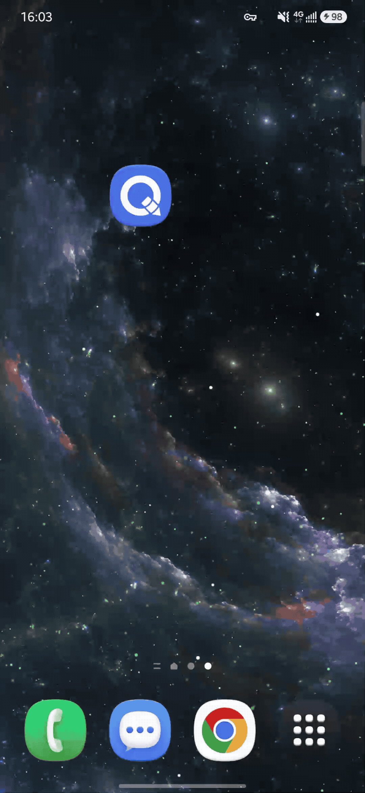
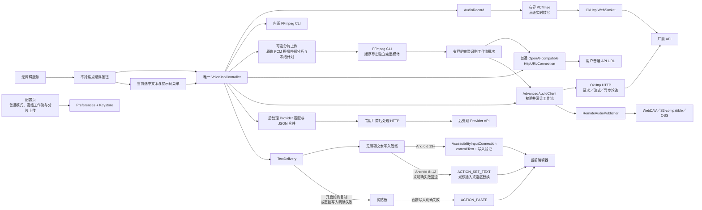
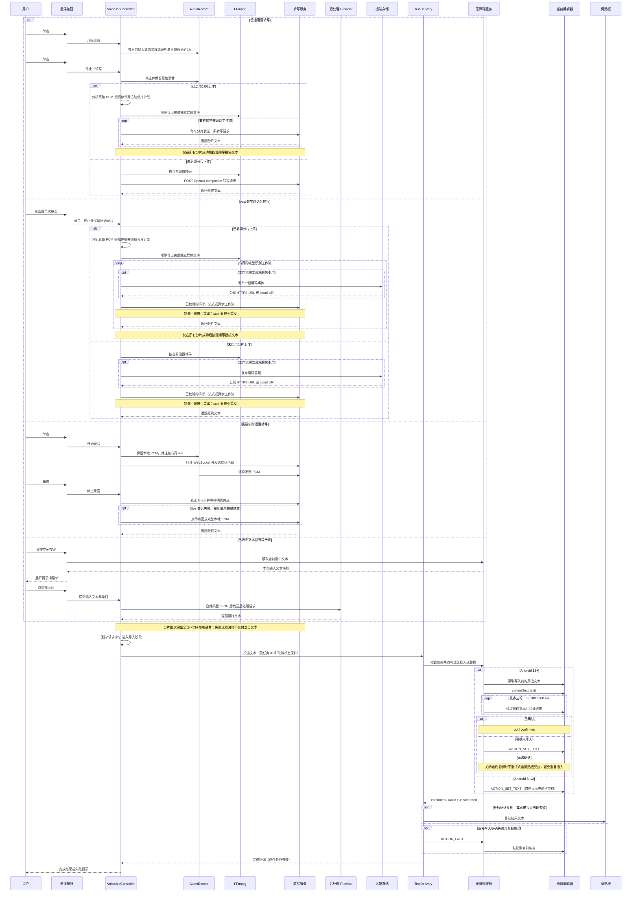
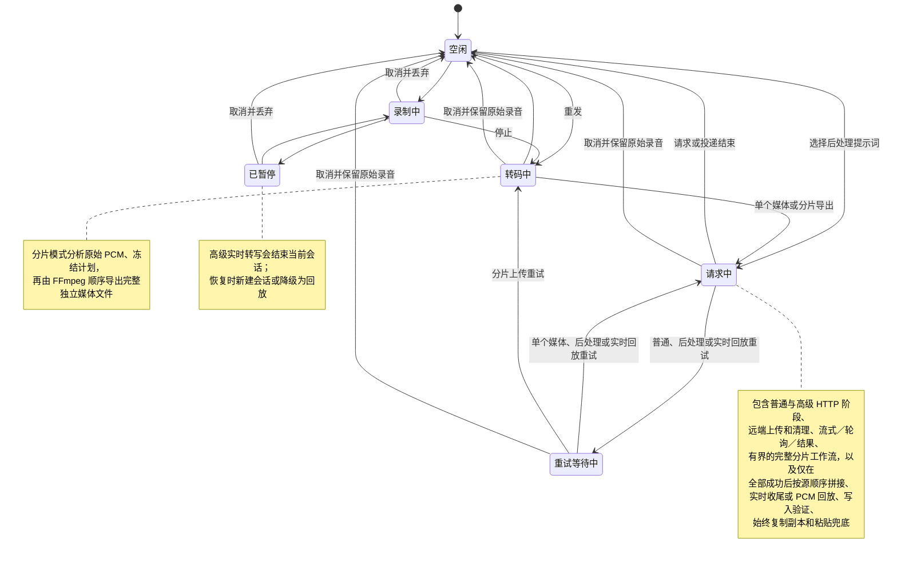

[English](README.md) | 简体中文

# Dictate

Dictate 是 Android 语音转写与选中文本后处理工具，通过不抢焦点的无障碍悬浮按钮操作。音频或选中文本直接发送到用户配置的指定服务，每次执行一个任务。转写和后处理共用同一个写入规则：实际写入时没有选区，就在当前光标处插入；有可编辑选区，就替换该段文本。

## 下载

| Platform | Download | SHA-256 |
|---|---|---|
| arm64-v8a | [arm64-v8a](https://github.com/Joey-Kot/Dictate/releases/download/Latest/Dictate-latest-arm64-v8a.apk) | [sha256](https://github.com/Joey-Kot/Dictate/releases/download/Latest/Dictate-latest-arm64-v8a.apk.sha256) |

## 操作演示与配置

| [](demo/Demo-ZH.gif) |
| :---: |
| **实际操作**<br>通过悬浮按钮录音转写，再选中文本，使用自定义提示词进行改写、翻译等操作。 |

| [](demo/1.%20Permissions.png) | [](demo/2.%20UI%20language.png) | [](demo/3.%20Audio%20Record%20Settings.png) |
| :---: | :---: | :---: |
| **1. 权限设置**<br>启用无障碍服务并授予麦克风权限。 | **2. 界面语言**<br>支持英语、中文、日语、德语、法语和俄语，选择后保存生效。 | **3. 录音设置**<br>选择输出采样率、编码、容器和比特率。 |
| [](demo/4.%20Audio%20API%20Settings.png) | [](demo/5.%20Rewrite%20API%20Settings.png) | [](demo/6.%20Prompt%20Edit.png) |
| **4. 音频 API 设置**<br>配置转写服务的 Base URL、API Key、模型及附加 JSON 参数，并通过真实转写请求测试连接。 | **5. 改写 API 设置**<br>配置文本后处理的服务商、Base URL、API Key 和模型，管理提示词顺序并测试连接。 | **6. 提示词编辑**<br>设置服务商、图标、标题、内容和附加 JSON；默认继承主 Provider，也可配置并测试独立 API。 |
| [](demo/7.%20Segmented%20Upload%20Settings.png) | [](demo/8.%20Retry%20Settings.png) | [](demo/9.%20Interaction%20Settings.png) |
| **7. 分片上传设置**<br>启用基于停顿分析的分片上传，设置最大分片时长、最小停顿时长和并发识别工作流数。 | **8. 重试设置**<br>开启自动重试，设置最大重试次数和初始等待时间。 | **9. 交互设置**<br>设置是否始终复制结果到剪贴板，以及长按阈值和双击最大间隔。 |
| [](demo/10.%20Display%20Settings.png) | [](demo/11.%20Configuration%20Saving%20and%20Import%26Export.png) | [](demo/12.%20Advanced%20Audio%20API%20Settings.png) |
| **10. 显示设置**<br>调整悬浮按钮大小、不透明度和各状态颜色，并管理通知设置。 | **11. 配置保存与导入导出**<br>保存设置，通过 JSON 导入或导出配置，以及查看或清空诊断信息。 | **12. 高级自定义 Audio API Provider**<br>根据独立的用户需求和厂商资料生成并校验声明式 ASR Provider 工作流，提供类型化、条件显示、单选和多选控件，支持单请求、流式响应、异步轮询和 WebSocket 实时转写。 |
| [](demo/13.%20Generate%20a%20workflow%20based%20on%20the%20requirements%20and%20the%20vendor%27s%20API%20documentation.png) | [](demo/14.%20Generated%20workflow%20JSON%20and%20summary.png) | [](demo/15.%20Configurable%20parameters%20dynamically%20generated%20according%20to%20user%20requirements.png) |
| **13. 生成工作流**<br>粘贴厂商文档请求示例，描述需要使用的参数，即可生成自定义 Audio API Provider 工作流。 | **14. 工作流 JSON 与摘要**<br>查看生成的 JSON 与摘要。 | **15. 动态参数与密钥**<br>校验后按工作流声明生成类型化控件；只有工作流需要时才显示远端音频。 |
| [](demo/16.%20Configurable%20cloud%20storage%20or%20WebDAV.png) | [](demo/17.%20Successfully%20tested%20the%20workflow%20API.png) |  |
| **16. 远端音频配置**<br>音频需要通过公网 URL 或云 URI 投递时，可配置 WebDAV、S3-compatible 或阿里云 OSS。 | **17. 工作流端点测试**<br>使用当前工作流草稿及其声明的值和密钥测试真实端点。 |  |

## 音频转录功能介绍

- **录音转写**：非 IME，通过不抢焦点的悬浮按钮进行录音转写，支持暂停、取消和重新转录最近一次录音，可熄屏使用。
- **文本改写**：配置提示词及不同服务商、模型、参数，选择文本后长按悬浮按钮可选择调用。
- **自定义 API**：配置普通 OpenAI-compatible 风格音频 API 与不同服务商的 Rewrite 接口、模型、提示词和额外请求参数。
- **高级自定义 Audio API Provider**：根据独立的用户需求和厂商资料生成并校验声明式 ASR Provider 工作流，提供类型化、条件显示、单选和多选控件，支持单请求、流式响应、异步轮询和 WebSocket 实时转写。
- **分片上传**：可选地将较长的非实时 ASR 任务拆为本地独立批次。基于原始 PCM 振幅停顿划分而不删除静音，FFmpeg 顺序导出完整媒体文件，再有界并发执行识别工作流；支持普通 OpenAI-compatible 转写和高级非实时工作流，不用于实时转写或 Rewrite。
- **自动写入**：转写与改写结果写入当前光标处或替换当前可编辑选区，默认保留结果的剪贴板副本，关闭后只有明确写入失败才使用剪贴板兜底。
- **音频处理**：选择录制和输出格式；内嵌 FFmpeg，无需另行安装。
- **本地并发分片上传**：基于音频振幅静音分析，以停顿作为优先断点并保留完整音频时间轴，将音频导出为独立媒体分片并受限并发提交至 ASR API。
- **任务与配置安全**：转码、网络请求和重试均可取消；API Key、工作流及远端存储密钥通过 Android Keystore 加密，并支持脱敏诊断、真实端点测试和已校验的 JSON 导入导出。

### 选中文本后处理功能介绍

- **选区操作菜单**：选中文本后长按空闲悬浮按钮，展开提示词列表，点击条目即可执行；没有选中文本或尚未保存提示词时，长按继续重发上一条录音。
- **独立服务配置**：在「改写 API 设置」中单独配置 Provider、Base URL、API Key 和 Model。支持 OpenAI-Compatible、OpenAI Responses、OpenAI Completions、Google、Anthropic、DeepSeek、Qwen、GLM。
- **每条提示词独立选择 Provider**：默认「与主 Provider 相同」（Same as main provider），继承整套改写 API 设置；也可设置独立 Provider、Base URL、API Key 和 Model，并在保存前测试连接。
- **自定义提示词与图标**：每项包含图标、标题、实际提示词及独立附加 JSON，支持新增、编辑、删除和排序。图标可使用 8 个内置选项，也可导入 SVG、PNG、JPG。
- **按提示词覆盖模型和参数**：各条目的附加 JSON 可覆盖所选 API 的 Model 及其他请求字段；嵌套对象逐层合并，数组整体替换，其他值直接覆盖，显式为 `null` 的对象字段在请求中删除。
- **按需处理文本**：通过自己编写的提示词，实现润色、改写、翻译、总结等操作；这些用途由用户配置，可处理已有文本或转写后的文本，无需先开始新的录音。
- **共用写入与任务控制**：后处理与转写共用处理中状态、双击取消及自动重试。结果按实际写入时的焦点和选区插入或替换；后处理完成、失败或取消均不替换上一条录音。

### 悬浮按钮操作

| 状态 | 单击 | 长按 | 快速双击 |
|---|---|---|---|
| 空闲 | 录制 | 有选中文本且提示词列表非空时展开菜单；其他情况重发上一条录音 | 无操作 |
| 录制中 | 停止并转写 | 暂停 | 取消并丢弃 |
| 已暂停 | 无操作 | 恢复 | 取消并丢弃 |
| 处理中 | 无操作 | 无操作 | 取消当前任务，保留已有录音 |

手势优先级固定为 `拖拽 > 长按 > 双击 > 单击`。长按在抬起时确认，因此只要抬起前任何时刻的移动超过系统触摸阈值，本次触摸就只会被判为拖动。短按会等待配置的双击判定窗口后再确认，保证快速双击始终只有一个明确结果。

提示词菜单是可纵向滚动的圆角半透明面板，从按钮位置平滑展开；点击菜单外区域收回空闲麦克风按钮。点击条目后收回圆形按钮并进入处理中状态。新安装或尚未添加提示词时，即使选中了文本，长按也继续重发上一条录音。

## 架构


```mermaid
flowchart LR
  A["无障碍服务"] --> B["不抢焦点悬浮按钮"]
  B --> C["唯一 VoiceJobController"]
  B --> L["当前选中文本与提示词菜单"]
  L --> C
  C --> D["AudioRecord"]
  C --> E["内嵌 FFmpeg CLI"]
  C --> SU["可选分片上传<br/>原始 PCM 振幅停顿分析与冻结计划"]
  SU --> SE["FFmpeg CLI<br/>顺序导出独立完整媒体"]
  SE --> SB["有界的完整识别工作流批次"]
  SB --> F
  SB --> AA
  C --> F["普通 OpenAI-compatible<br/>HttpURLConnection"]
  F --> G["用户普通 API URL"]
  C --> AA["AdvancedAudioClient<br/>校验并渲染工作流"]
  AA --> OH["OkHttp HTTP<br/>请求／流式／异步轮询"]
  OH --> V["厂商 API"]
  AA --> RA["RemoteAudioPublisher"]
  RA --> RS["WebDAV／S3-compatible／OSS"]
  D --> RT["有界 PCM tee<br/>高级实时转写"]
  RT --> WS["OkHttp WebSocket"]
  WS --> V
  C --> H["后处理 Provider 适配与 JSON 合并"]
  H --> PH["专用厂商后处理 HTTP"]
  PH --> PV["后处理 Provider API"]
  C --> T["TextDelivery"]
  T --> W["无障碍文本写入管线"]
  W -->|"Android 13+"| M["AccessibilityInputConnection<br/>commitText + 写入验证"]
  W -->|"Android 8–12<br/>或明确失败回退"| S["ACTION_SET_TEXT<br/>光标插入或选区替换"]
  M --> X["当前编辑器"]
  S --> X
  T -->|"开启始终复制<br/>或直接写入明确失败"| I["剪贴板"]
  I -->|"直接写入明确失败"| P["ACTION_PASTE"]
  P --> X
  J["配置页<br/>普通模式、高级工作流与分片上传"] --> K["Preferences + Keystore"]
```

## 请求流程


```mermaid
sequenceDiagram
  participant U as 用户
  participant O as 悬浮按钮
  participant J as VoiceJobController
  participant R as AudioRecord
  participant F as FFmpeg
  participant V as 转写服务
  participant P as 后处理 Provider
  participant S as 远端存储
  participant D as TextDelivery
  participant A as 无障碍服务
  participant E as 当前编辑器
  participant C as 剪贴板
  alt 普通语音转写
    U->>O: 单击
    O->>J: 开始录音
    J->>R: 按当前输入路由采样率录制单声道原始 PCM
    U->>O: 单击
    O->>J: 停止并转写
    J->>R: 停止并保留原始录音
    alt 已启用分片上传
      J->>J: 分析原始 PCM 振幅停顿并冻结分片计划
      J->>F: 顺序导出完整独立媒体文件
      loop 有界的完整识别工作流
        J->>V: 每个分片发送一条转写请求
        V-->>J: 返回分片文本
      end
      Note over J,V: 仅在所有分片成功后按源顺序拼接文本
    else 未启用分片上传
      J->>F: 按当前设置转码
      J->>V: POST OpenAI-compatible 转写请求
      V-->>J: 返回最终文本
    end
  else 高级非实时语音转写
    U->>O: 单击后再次单击
    O->>J: 录音、停止并保留原始录音
    alt 已启用分片上传
      J->>J: 分析原始 PCM 振幅停顿并冻结分片计划
      J->>F: 顺序导出完整独立媒体文件
      loop 有界的完整识别工作流
        opt 工作流需要远端音频引用
          J->>S: 发布一段编码媒体
          S-->>J: 公网 HTTPS URL 或 cloud URI
        end
        J->>V: 已校验的请求、流式或异步工作流
        Note over J,V: 轮询／结果可重试；submit 绝不重发
        V-->>J: 返回分片文本
      end
      Note over J,V: 仅在所有分片成功后按源顺序拼接文本
    else 未启用分片上传
      J->>F: 按当前设置转码
      opt 工作流需要远端音频引用
        J->>S: 发布编码音频
        S-->>J: 公网 HTTPS URL 或 cloud URI
      end
      J->>V: 已校验的请求、流式或异步工作流
      Note over J,V: 轮询／结果可重试；submit 绝不重发
      V-->>J: 返回最终文本
    end
  else 高级实时语音转写
    U->>O: 单击
    O->>J: 开始录音
    J->>R: 保留本地 PCM，并挂接有界 tee
    J->>V: 打开 WebSocket 并发送初始消息
    R->>V: 逐块发送 PCM
    U->>O: 单击
    O->>J: 停止录音
    J->>V: 发送 finish 并等待明确完成
    opt live 会话失败、积压或未完整结束
      J->>V: 从零点回放完整本地 PCM
    end
    V-->>J: 返回最终文本
  else 已选中文本且有提示词
    U->>O: 长按空闲按钮
    O->>A: 读取当前选中文本
    A-->>O: 本次输入文本快照
    O-->>U: 展开提示词菜单
    U->>O: 点击提示词
    O->>J: 提交输入文本与条目
    J->>P: 合并条目 JSON 后发送后处理请求
    P-->>J: 返回最终文本
  end
  Note over J,V: 分片批次保留全部 PCM 帧和静音；失败或取消时不交付部分文本
  J->>J: 保持“请求中”，进入写入阶段
  J->>D: 投递文本（受任务 ID 和取消状态保护）
  D->>A: 按此刻的焦点和选区插入或替换
  alt Android 13+
    A->>E: 读取写入前的周边文本
    A->>E: commitText(text)
    loop 最多三轮：0 / 100 / 300 ms
      A->>E: 读取周边文本并验证结果
    end
    alt 已确认
      Note over A,E: 返回 confirmed
    else 明确未写入
      A->>E: ACTION_SET_TEXT
    else 无法确认
      Note over A,E: 关闭始终复制时不重试或走剪贴板兜底，避免重复插入
    end
  else Android 8–12
    A->>E: ACTION_SET_TEXT（忽略显示中的占位符）
  end
  A-->>D: confirmed / failed / unconfirmed
  opt 开启始终复制，或直接写入明确失败
    D->>C: 复制结果文本
  end
  opt 直接写入明确失败且复制成功
    D->>A: ACTION_PASTE
    A->>E: 粘贴到当前焦点
  end
  D-->>J: 完成回调（仅任务仍有效）
  J-->>U: 完成结果或失败提示
```

后处理在展开菜单前捕获选中文本作为本次输入。转写与后处理的输出位置都在实际写入时确定，不绑定请求开始时的输入框或选区；等待期间更换输入框、光标或选区后，使用写入时的状态。两类任务沿用同一套写入验证和剪贴板兜底策略。

## 任务状态机


```mermaid
stateDiagram-v2
  [*] --> 空闲
  空闲 --> 录制中
  空闲 --> 转码中: 重发
  空闲 --> 请求中: 选择后处理提示词
  录制中 --> 已暂停
  已暂停 --> 录制中
  录制中 --> 转码中: 停止
  转码中 --> 请求中: 单个媒体或分片导出
  请求中 --> 重试等待中: 普通、后处理或实时回放重试
  重试等待中 --> 请求中: 单个媒体、后处理或实时回放重试
  重试等待中 --> 转码中: 分片上传重试
  请求中 --> 空闲: 请求或投递结束
  转码中 --> 空闲
  录制中 --> 空闲: 取消并丢弃
  已暂停 --> 空闲: 取消并丢弃
  转码中 --> 空闲: 取消并保留原始录音
  请求中 --> 空闲: 取消并保留原始录音
  重试等待中 --> 空闲: 取消并保留原始录音
  note right of 请求中
    包含普通与高级 HTTP 阶段、
    远端上传和清理、流式／轮询／结果、
    有界的完整分片工作流，以及仅在
    全部成功后按源顺序拼接、
    实时收尾或 PCM 回放、写入验证、
    始终复制副本和粘贴兜底
  end note
  note right of 转码中
    分片模式分析原始 PCM、冻结计划，
    再由 FFmpeg 顺序导出完整独立媒体文件
  end note
  note right of 已暂停
    高级实时转写会结束当前会话；
    恢复时新建会话或降级为回放
  end note
```

内部任务状态仍为空闲、录制中、已暂停、转码中、请求中和重试等待中。高级 HTTP 工作流阶段复用请求中；其阶段级重试不会进入重试等待中，也不会重新 submit 异步任务。实时 PCM 回放的重试会进入重试等待中，并从零点重新开始。菜单展开属于空闲时的界面状态，不启动请求。后处理直接进入请求中，跳过录音和转码；完成、失败或取消均不替换上一条录音。

## 使用要求

- Android 8.0+（`minSdk 26`）和 `arm64-v8a` 设备。
- 已启用的 Dictate 无障碍服务；录音还需要麦克风权限。
- 转写需要普通 OpenAI Compatible `POST /v1/audio/transcriptions` 端点、Base URL、API Key 和模型，或启用已校验的高级音频 API 工作流及其声明的值和密钥。
- 后处理需要有效的 Provider、Base URL、API Key、模型配置及至少一条提示词；API 配置可使用公共设置，也可按提示词单独设置。

选区读取及无障碍写入依赖目标应用提供的能力。只读文本可以作为后处理输入；密码框、受保护界面和自绘控件可能不暴露选区或拒绝写入。无可写入焦点时沿用剪贴板兜底，项目不做逐 App 专项兼容。

Android 13 及以上版本在无障碍节点未提供选中文本时，还会通过当前编辑器的输入连接在后台读取选区，再决定展开提示词菜单还是重发录音。读取不会改变剪贴板；等待期间若编辑器、选区或当前任务发生变化，则丢弃过期结果。

## 从源码构建

使用 JDK 17、Android SDK Platform 35、Build Tools 35.0.0、NDK `27.2.12479018`。

```bash
export ANDROID_HOME=/path/to/android-sdk
export ANDROID_NDK_HOME="$ANDROID_HOME/ndk/27.2.12479018"
export GRADLE_USER_HOME=/tmp/gradle-user-home
./gradlew :app:assembleDebug
```

`assembleDebug` 会在 arm64 FFmpeg 二进制缺失或构建脚本发生变化时自动执行 `scripts/build-android-ffmpeg.sh`，并将结果打包到 `app/src/main/jniLibs/arm64-v8a/libffmpeg.so`。这要求已安装 Android NDK，并通过 `ANDROID_NDK_HOME` 或 `ANDROID_NDK_ROOT` 指定；未变化的 Debug 构建会复用已生成的二进制。脚本仍可单独执行，用于只重建本地原生组件。签名 release 还需 `ANDROID_KEYSTORE_PATH`、`ANDROID_KEYSTORE_PASSWORD`、`ANDROID_KEY_ALIAS`、`ANDROID_KEY_PASSWORD`。

Release 构建启用 R8 代码压缩、优化、混淆和资源缩减。CI 将 `mapping.txt` 保存为工作流产物，用于还原崩溃堆栈。Debug 构建保持不压缩。

原生构建需要 Linux、`make`、`pkg-config`、`curl`、`tar` 和 XZ 支持。脚本用 SHA-256 核验 FFmpeg `8.1`、Opus `1.5.2`、LAME `3.100`、libogg `1.3.5`、libvorbis `1.3.7`、OpenCORE AMR `0.1.6`、VisualOn AMR-WB `0.1.3`、Speex `1.2.1` 的源码包，只构建 AArch64，逐项检查必需的 demuxer、编码器、容器和滤镜，并验证生成的 Android PIE 可执行文件采用 16 KiB 加载对齐。此 FFmpeg 构建启用 `--enable-gpl --enable-version3`，依赖许可和校验值记录在 [THIRD_PARTY_LICENSES.md](THIRD_PARTY_LICENSES.md)。

完成原生构建后，可用 QEMU 配合 Android 8 运行库执行实际打包的 Android 二进制进行音频集成测试。额外需要 `qemu-user`（`qemu-aarch64`）、`e2fsprogs`（`debugfs`）、Python 3 和主机 C 编译器。脚本直接从 SDK 镜像提取运行库，无需挂载镜像，并使用已下载的源码构建独立的 FFmpeg 8.1 解码器和探测工具。

```bash
"$ANDROID_HOME/cmdline-tools/latest/bin/sdkmanager" 'system-images;android-26;default;arm64-v8a'
DICTATE_AUDIO_FULL=1 ./scripts/test-android-audio.sh
./gradlew :app:testDebugUnitTest :app:lintDebug
```

完整音频矩阵覆盖所有可选编码与容器、采样率预设和可选位深度，检查默认、最低、最高码率，以及 AMR/Speex 的全部码率档位。验证内容包括解码结果、流参数、裸 PCM 长度和字节序，以及单声道向双声道、六声道逐样本复制。CI 在发布打包前执行此矩阵；QEMU 验证不能替代麦克风和真机测试。

随 APK 分发的连通性测试音频是单词 “test” 的 16 kHz 单声道合成语音，使用 Flite `2.2` 的 `cmu_us_slt` 语音生成。可复现命令位于 `scripts/generate-connectivity-test-audio.sh`，来源与 CMU 许可记录在 `THIRD_PARTY_LICENSES.md`。

GitHub Release 签名使用以下仓库 Secrets：

```text
ANDROID_KEYSTORE_BASE64
ANDROID_KEYSTORE_PASSWORD
ANDROID_KEY_ALIAS
ANDROID_KEY_PASSWORD
```

GitHub Actions 是默认发布路径。推送到 `main`、`dev` 或使用可选 ref 手动触发后，会构建签名 arm64 APK、标准 SHA-256 文件，强制更新 `Latest` tag，删除 Release 旧附件并只上传当前两个文件。所有发布任务共用一个并发组，避免较旧的重叠构建反向覆盖较新的 `Latest`。

## 使用方法（配置）

1. 授予麦克风权限，在 Android 无障碍设置中启用 Dictate。通知可通过「显示设置」中的开关开启或关闭。
2. 普通模式填写 Base URL（`https://example.com` 或 `https://example.com/v1`）、API Key 和模型；也可启用「高级音频 API 设置」，粘贴或生成已校验工作流，再填写其声明的值和密钥。
3. 普通模式可选填写完整附加 JSON 对象，按下述合并规则生成 multipart 参数；对象和数组序列化为 JSON 字段值。`model` 可以覆盖，`file` 属于二进制音频附件，同名附加参数会报告冲突。
4. 执行真实端点测试：普通模式按当前音频设置转码内置短语音并调用转写端点，不使用 `/v1/models`；高级模式使用当前未保存的工作流草稿及其值和密钥。
5. 可选配置悬浮按钮大小、不透明度，以及预置或 Custom 三状态色系；保存配置后，在普通可编辑输入框中保留光标并使用悬浮按钮。

「录音设置」上方设有语言选项，默认英文，不随系统语言变化。列表依次为 English、中文、日本語、Deutsch、Français、Русский，选择后点击「保存设置」生效，覆盖界面、弹窗、状态提示和录音通知。此选项不改变语音转写的语言，也不修改用户填写的提示词和 API 参数。

各设置区域不带编号，依次为：录音设置、音频 API 设置、改写 API 设置、高级音频 API 设置、分片上传设置、重试设置、交互设置、显示设置。标题随界面语言切换；底部「关于」展示作者、邮箱、许可证、仓库地址和当前安装版本的版本号。

「显示通知」开关反映系统中的应用通知及录音通知渠道状态。点击后进入系统通知设置，返回时自动同步；关闭通知不影响录音。Android 13 及以上版本关闭通知栏通知后，系统任务管理器仍可能显示正在运行的前台服务。此项由系统管理，不随应用配置导出。

### 高级音频 API 设置

当普通 OpenAI-compatible 转写接口无法覆盖厂商协议时，可启用这项可选模式。粘贴兼容的声明式工作流，或填写需求并提供厂商文档、请求示例以生成工作流；只有校验并应用后，才填写动态生成的参数和密钥。

已校验工作流通过公网 HTTPS URL 或云 URI 投递音频时，才显示远端音频设置。按需选择 WebDAV、S3-compatible 存储或阿里云 OSS。点击「测试工作流」会使用当前未保存的草稿、其声明的值和密钥访问真实端点。

### 分片上传设置

此功能默认关闭。默认最大分片时长为 295 秒，最小停顿时长为 700 ms，并发完整识别工作流数为 1。它适用于普通 OpenAI-compatible 转写，以及高级非实时 `request`、`request_stream`、`async_poll` 工作流，保留高级工作流支持的全部非实时投递方式：`multipart_file`、`raw_audio`、`base64`、`data_uri`、`public_https_url`、`cloud_uri`、`provider_upload`。它不适用于高级实时会话或 Rewrite。

规划器分析原始 PCM 振幅，在接近上限的位置选择停顿，并保留包括静音在内的全部 PCM 帧。上限前没有合格停顿时，在上限处截断。FFmpeg 按顺序将每个连续区间导出为完整、独立的媒体文件；并发数限制的是完整识别工作流，不限制本地编码。

只有全部分片成功，才按原始顺序直接拼接文本。任一分片失败或用户取消时，会取消尚未完成的工作且不交付部分文本。首次分片尝试会冻结分片计划和分片参数；自动重试与重发最近录音会按该计划从原始 PCM 重新导出，不重新分析停顿。

### 音频编码设置

录音保持 16-bit 单声道 PCM，采样率由当前输入路由决定。编码时由 FFmpeg 转换采样格式、位深度并重采样。目前所有可选编码器都接受单声道；如果编码器要求更多声道，转换流程会选择其支持的最小声道布局，将原始单声道复制到每个声道。

默认仍为 MP3、自动采样率和 128 kbps。自动模式先将录音采样率限制到最高 48 kHz，再选择编码器支持的最近采样率，距离相同时取较低值。如果保存的码率与实际采样率不兼容，本次录音采用该采样率下的默认码率，保留已保存的配置。手动采样率预设包括 7.35、8、11.025、12、16、22.05、24、32、44.1、48、64、88.2、96、176.4、192 kHz，按编码器过滤。

| 编码选项 | 输出容器 | 采样率／位深度限制 |
|---|---|---|
| Opus | OPUS、OGG、WEBM、MP4、MKV、MKA | 8 / 12 / 16 / 24 / 48 kHz |
| MP3 | MP3、WAV、AVI、MKV、MKA、MPEG；满足条件时提供 MP4/FLV | 8～48 kHz 的预设；容器限制见下文 |
| AAC | M4A、MP4、AAC（ADTS）、FLV、MKV、MKA、MOV | 最高 96 kHz；AAC/WAV 无法可靠完成编码后解码，因此不提供 |
| Vorbis | OGG、WEBM、MKV、MKA | 8～48 kHz 的预设 |
| FLAC | FLAC、OGG、MKV、MKA | 16 / 24-bit 输出 |
| ALAC | M4A、MP4、MOV | 16 / 24-bit 输出 |
| AC-3 | AC3、M4A、MP4、WAV、AVI、MKV、MKA、MPEG | 32 / 44.1 / 48 kHz |
| E-AC-3 | EAC3、MP4、MKV、MKA | 32 / 44.1 / 48 kHz |
| MP2 | WAV、MP4、MPEG | 16 / 22.05 / 24 / 32 / 44.1 / 48 kHz |
| ADPCM（MS） | WAV | 从 PCM16 转换 |
| AMR-NB | AMR、WAV | 8 kHz；精确的 4.75～12.2 kbps 档位 |
| AMR-WB | AMR | 16 kHz；精确的 6.6～23.85 kbps 档位 |
| Speex | SPX、OGG | 8 / 16 / 32 kHz；采用对应采样率的实际码率档位 |
| WavPack | WV | 16 / 24 / 32-bit 输出 |
| WMA v1 / v2 | WMA、ASF | 8～48 kHz 的预设 |
| PCM | WAV；16/24/32-bit 可用 MP4、MOV 及对应的 S16LE/S24LE/S32LE 裸流；16-bit 另可用 AVI | 8 / 16 / 24 / 32-bit；无符号 8-bit 使用 WAV |
| PCM 8-bit（有符号） | AIFF、S8 | 固定有符号 8-bit |
| PCM A-law / μ-law | WAV、对应的 ALAW/MULAW 裸流 | 固定压扩格式 |
| PCM Float 32/64-bit（LE） | WAV、MP4、对应的 F32LE/F64LE 裸流 | 固定浮点格式 |
| PCM 64-bit（LE） | WAV | 固定有符号 64-bit |
| PCM 16/24/32-bit（BE） | AIFF、MP4、对应的 S16BE/S24BE/S32BE 裸流 | 固定大端整数格式 |
| PCM Float 32/64-bit（BE） | AIFF、MP4、对应的 F32BE/F64BE 裸流 | 固定大端浮点格式 |

MP3 使用 MP4 时要求至少 16 kHz；使用 FLV 时只提供 11.025、22.05、44.1、48 kHz。自动采样率下的 MP3 采用公共容器集合，不提供 MP4/FLV，以保证切换输入路由后仍保留所选容器。表中未限制采样率的编码器使用完整预设列表。

位深度控件用于 PCM、FLAC、ALAC、WavPack；码率控件只用于接受目标码率的编码器。码率按精确的 bps 保存并传给 FFmpeg，因此 AMR-NB 的 4.75 kbps、AMR-WB 的 23.85 kbps 等值不会被取整。文件扩展名和上传 MIME 类型统一取自实际编码设置，AMR-WB 使用 `audio/amr-wb`，裸 PCM 使用 `application/octet-stream`。

上表表示本地输出能力，所配置的转写服务还需接受对应编码、容器和采样率。裸 PCM 没有格式头，接收方需要获知匹配的采样格式、采样率和声道数；可使用目标设置执行端点测试，确认服务兼容性。

### 后处理配置

公共配置依次为 Provider、Base URL、API Key、Model，下方是「新增提示词」、已保存条目和「测试连接」。支持 OpenAI-Compatible、OpenAI Responses、OpenAI Completions、Google、Anthropic、DeepSeek、Qwen、GLM。OpenAI Completions 使用 `/chat/completions` 接口。提示词放入对应 Provider 的系统／开发者级指令位置，选中文本作为用户输入。

点击「新增提示词」或已有条目，在弹窗内配置 Provider、图标、标题、提示词内容和附加 JSON。点击保存后，提示词及其独立 API Key 一并持久化。保存时校验标题、内容和附加 JSON，允许 API 字段尚未填完，测试或执行时再检查。编辑弹窗支持删除，列表的上下箭头调整菜单顺序；公共配置通过「保存设置」提交。

新增提示词和升级前已保存的提示词默认选择「与主 Provider 相同」（Same as main provider）。这里的「主」指「改写 API 设置」中的公共配置，整套继承 Provider、Base URL、API Key 和 Model。选择具体 Provider 后完全使用该条目的 API 字段，即使它与主 Provider 相同，空字段也不会借用公共值。切回继承模式会隐藏并保留独立字段及密钥，但请求不使用这些隐藏值。

图标提供 8 个内置选项，也可导入 SVG、PNG、JPG。自定义图标复制到应用私有目录，单个文件最多 1 MiB，总计最多 8 MiB；配置导出携带被引用的图标，缺失或无效资源回退到内置图标。

公共「测试连接」使用当前公共配置发送最小文本请求，遵循「重试设置」。转写和正常执行提示词也遵循该设置。每次执行提示词时只解析一次实际 API 配置；任务运行期间修改设置，不会改变该任务及其重试所用的 API、输入、附加 JSON 和重试参数。

选择独立 Provider 后，提示词编辑弹窗会显示「测试连接」。它使用尚未保存的 Provider、Base URL、API Key 和 Model，以及固定的最小指令和输入，忽略条目的标题、提示词正文与附加 JSON。测试只发一次请求，不自动重试，不保存设置，也不写入编辑器或剪贴板。修改 API 字段、切换 Provider、关闭弹窗或销毁页面都会取消该测试；旋转屏幕会保留草稿并取消测试，恢复后不自动重测。公共连接测试同样不写入编辑器或剪贴板。

### 附加 JSON 合并

输入应为 JSON 对象，可留空。先生成基础请求，再应用附加 JSON：对象逐层合并，数组整体替换，其他值覆盖同层同名字段。附加 JSON 中对象字段的值为 `null` 时删除该字段，原来不存在也不创建；数组中的 `null` 元素仍是数组值。保存、编辑和导出保留删除指令，只在生成请求时执行。

例如某条提示词配置以下参数，将使用 `another-model`，并删除基础请求中的 `temperature`：

```json
{
  "model": "another-model",
  "temperature": null,
  "metadata": { "task": "summary" }
}
```

所选公共或独立 API 配置中的 Model 是默认值，最终请求按合并后的 Model 校验。Google 的最终模型用于请求 URL。附加参数应符合所选 Provider 的接口格式；字段删除后缺少接口必需参数时会收到配置或服务端错误。

配置导出使用 `schemaVersion: 8`，音频码率使用精确的 `audioOutput.bitrateBps`，同时包含界面语言 `language` 标签、后处理公共配置、有序提示词及可选的独立 API 配置、自定义图标，以及不含密钥的 `advancedAudio` 和 `segmentedUpload` 配置。提示词的 `provider` 为 `null` 表示继承，独立配置保存 `provider`、`baseUrl` 和 `model`。支持导入 1～8 版配置；第 7、8 版都必须包含 `advancedAudio`，第 8 版还必须包含 `segmentedUpload`；导入 1～7 版时，分片上传初始化为关闭、295 秒、700 ms、并发 1。1～4 版的 `bitrateKbps` 会换算为 bps；保留已有 PCM/WAV 设置，包括无符号 8-bit。旧版 Opus 的 32/44.1 kHz 选择迁移为 48 kHz，与此前实际编码输出一致。1～3 版配置的提示词默认为空列表，提示词缺少 `provider` 时继承主 API，没有 `language` 字段时默认英文。无效编码组合会在应用导入前被拒绝。

“始终复制到剪贴板”默认开启。关闭后恢复为仅兜底模式：只有当前焦点明确写入失败时才复制。无法确认写入结果时，不会自动重试或复制，因为文本仍可能已写入编辑器。

应使用 HTTPS。音频和待处理文本分别直接发送到配置的 Base URL；Dictate 不提供 API、代理或账号系统。转写、公共改写 API、各提示词的独立 API Key，以及 Advanced Audio API 的工作流和远端存储密钥均使用 Android Keystore 中的 AES 密钥分别加密，导出不含密钥。提示词密钥按稳定的条目 ID 保存，改名和排序不改变归属，删除条目时一并清理。

导入任何密钥都需要明确确认，包括提示词中可选的 `apiKey` 和 `advancedAudio.secrets` 映射。导入条目未提供 `apiKey` 时，只有条目 ID、Provider 和去掉首尾空白的 Base URL 均与现有条目一致，才保留原密钥；否则密钥为空。显式提供空字符串 `apiKey` 会清除已有密钥。若导入文件省略 `advancedAudio.secrets`，只有不含密钥的 `advancedAudio` 配置与现有配置完全一致时才保留已有高级密钥；否则会清除。

## 许可证

`GPL-3.0-or-later`。详见 [LICENSE](LICENSE)、[NOTICE](NOTICE)、[THIRD_PARTY_LICENSES.md](THIRD_PARTY_LICENSES.md)。
